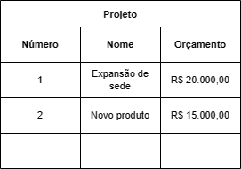

# **Banco de dados**
### Aula 02
#### Fundamentos de Banco de Dados
Felipe Marx Benghi
https://github.com/fbenghi/BancoDeDados2023-2

---
# Objetivos
- [x] Dados, informação e conhecimento
- [x] SGBDs
- [x] Tipos de bancos de dados (hierárquico, relacional, O.O., noSQL etc.)
- [x] Simulação inserção de dados em planilhas.
- [x] Níveis de abstração de dados (conceitual, lógico e físico)

---
## Dado vs Informação vs Conhecimento
* Dados: fatos em sua forma primária. 
Ex: Quantidade de pedidos

* Informação: conjunto de fatos (dados) organizados para adquirirem valor adicional além do valor do fato em si. 
Ex: Quantidade de pedidos cancelados

* Conhecimento: selecionar, organizar e manipular dados, para torná-los úteis para uma tarefa específica.
Ex: Quantidade de pedidos cancelados no primeiro trimestre de 2012

---
## Dado vs Informação vs Conhecimento

---
## Dado vs Informação vs Conhecimento

---
## Dado vs Informação vs Conhecimento
Conhecimento é a resposta para uma pergunta gerencial
- Qual vendedor deve receber o prêmio de melhor?
- Meu estoque é suficiente?

---
## Dado vs Informação vs Conhecimento

---

## Banco de dados
“É uma coleção de dados relacionados. Com dados, queremos dizer fatos conhecidos que podem ser registrados e possuem significado implícito”.
(ELMASRI e NAVATHE, 2011, p.3)

---
# Organização dos dados em um banco
## Arquivos, registros e campos

---
### Exercício: 
Utilizando uma ferramenta de planilhas, com o Microsoft Excel, simule a inserção de dados em um banco de dados com as seguintes características: 

* A empresa é organizada em departamentos. Cada departamento tem um nome exclusivo e um número exclusivo.
* Um departamento controla uma série de projetos, cada um deles com um nome exclusivo, um número exclusivo e um orçamento exclusivo
* Funcionários: armazenamos o nome, número do CPF, salário e genero.
---
### Representação dos dados

---
### Representação dos dados

---
### Representação dos dados

---
## Persistência: Banco de Dados vs Arquivos 
* Arquivos

---

* Banco de dados

---
## Quando NÃO usar um banco de dados:
Melhor usar arquivos quando:
- Dados bem simples e estruturas bem definidas, em que não se esperam mudanças
- Tempo de processamento precisa ser muito rápido - ex. software de CAD usado por engenheiro civil e mecânicos
- Capacidade de processamento limitada - normalmente presente em sistemas embarcados
- **Sem acesso de múltiplo usuários**

---
## Quando USAR um banco de dados
Um banco de dados:
* Impede redundância de atributos
* Garante integridade - evitar dados (in)consistentes
* Garante isolação dos dados - quando os dados estarão visíveis
* Possui níveis de segurança - quem pode ler / escrever
* Acesso concorrente - vários usuários acessando / escrevendo simultaneamente os registros

---
## Sistemas Gerenciadores de Banco de Dados (SGBD)

* É o conjunto de programas de computador (softwares) responsáveis pelo gerenciamento de uma base de dados
* Retiram da aplicação responsabilidade de gerenciar o acesso, a manipulação e a organização dos dados

O que chamamos de Banco de Dados é na verdade o SGBD, o correto é chamá-los de: SGBD Oracle, SGBD MySQL, SGBD SQL Server, etc.

**SGBD gerenciam a base de dados!!!**

---
## Corrigindo...

--- 
## Responsabilidade dos SGBD

- Salvar os dados no HD
- Manter em memória os dados mais acessados
- ligar dados e metadados
- Disponibilizar uma interface para programas e usuários externos acessem o banco de dados (para banco de dados relacionais, é utilizada a linguagem SQL)
- Encriptar dados
- Controlar o acesso a informações
- Manter cópias dos dados para recuperação de uma possível falha
- Garantir transações no banco de dados

---
## Atores
### Administrador:
- Autorizam o acesso ao banco de dados
- Coordenam e monitorar seu uso e adquirir recursos de 
software e hardware conforme a necessidade
- Também é responsável por problemas como falhas na segurança e demora no tempo de resposta do sistema

---
## Atores
### Programadores de Aplicações
* Identificam as necessidades dos usuários finais e definem as especificações das transações padrão que atendam a essas necessidades 
* Engenheiros de software e desenvolvedores de 
sistemas de software

---
## Atores
### Usuários finais:
Pessoas cujas funções exigem acesso ao banco de dados para: 
1. Consultas
1. Atualizações
1. Geração de relatórios

Exemplo: um caixa de supermercado faz essas 3 operações

---
## Atores

---
## Tipos de banco de dados
* Rede;
* Hierárquico;
* Relacional;
* Orientado a Objetos;
* No-SQL.

---
## Banco de dados em rede
Os dados são representados por um conjunto de registros e as relações entre estes registros são representados por links (ligações), as quais podem ser vistas pelos ponteiros.

---
## Banco de dados hierárquicos
* É similar ao modelo em rede, pois os dados e suas relações são representados por registros e links. A diferença é que no modelo hierárquico os registros estão organizados em árvores em vez de gráficos arbitrários.

---
## Banco de dados relacionais
Usa um conjunto de tabelas para representar tanto os dados quanto a relação entre eles. Cada tabela possui múltiplas colunas e cada uma possui um nome único.

---
### Banco de dados orientado a objetos
* Sugere uma implementação baseada em classes, considerando hierarquia de tipos e sub-tipos;
* Utiliza ponteiros para fazer as referências entre os diferentes tipos.

---
## Banco de dados NoSQL
Not Only SQL (Não Somente SQL). Alguns exemplos:
* Chave-Valor: Armazena dados em tabelas hash. Ex.: MemcacheD, Riak;
* Grafo: Armazena dados na forma de grafo. Ex.: Sesame, Neo4j;
* Coluna: Armazena dados em linhas particulares de tabela. Ex.: 8 Cassandra, Hbase;
* Documento: Armazena os dados como “documentos”. Ex.: MongoDB, CouchDB

---

## Modelagem de Dados
Abstração = supressão (escolher) o nível de detalhes

* Nível Conceitual – **representação do mundo real**. Define quais dados aparecerão no BD e como eles se relacionam, mas sem se importar com a implementação no SGBD.

* Nível Lógico – nível do **SGBD**, ou seja, depende do tipo particular de SGBD que será usado (relacional, orientado a objetos...).

* Nível Físico – descreve como esses dados estarão de fato armazenados, partição de discos. É onde os dados existem / são gravados.

---
## Nível Conceitual
Representação dos dados mais próxima do mundo real - Como os usuários percebem os dados.
* Entidade: objeto ou conceito do mundo real. Exemplo: funcionário, projeto. 
* Atributo: alguma propriedade de interesse que descreve uma entidade. Exemplo: o salário do funcionário
* Relacionamento: associação entre em entidades. Exemplo: um funcionário trabalha em um projeto

---
### Modelagem Conceitual

Precisamos criar o banco de dados para uma EMPRESA, sabendo que:
* A empresa é organizada em departamentos. Cada departamento tem um nome exclusivo e um número exclusivo.
* Um departamento controla uma série de projetos, cada um deles com um nome exclusivo, um número exclusivo e um orçamento exclusivo
* Funcionários: armazenamos o nome, número do CPF, endereço, salário. Um funcionário trabalha para um departamento, mas pode trabalhar em vários projetos, que não necessariamente são controlados pelo mesmo departamento

---
### Modelagem Conceitual

---
## Continuando o exemplo...
* Queremos registrar os dependentes de cada funcionário para fins de seguro. Para cada dependente, mantemos o nome, sexo, data de nascimento e parentesco com o funcionário

---
## Continuando o exemplo...

* Cada departamento tem um nome exclusivo, um número exclusivo e um funcionário em particular que o gerencia. 
* Todo funcionário tem um supervisor direto (que é outro funcionário)