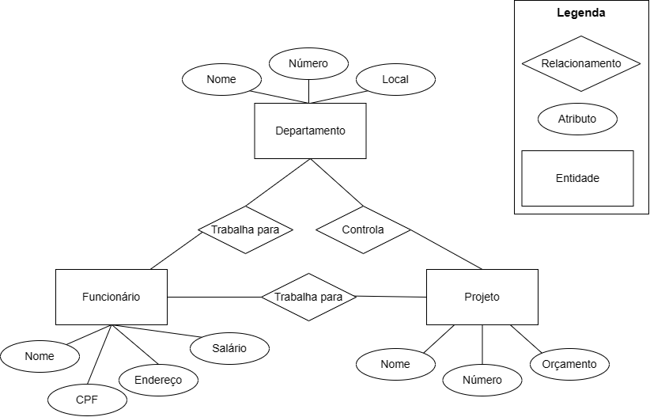
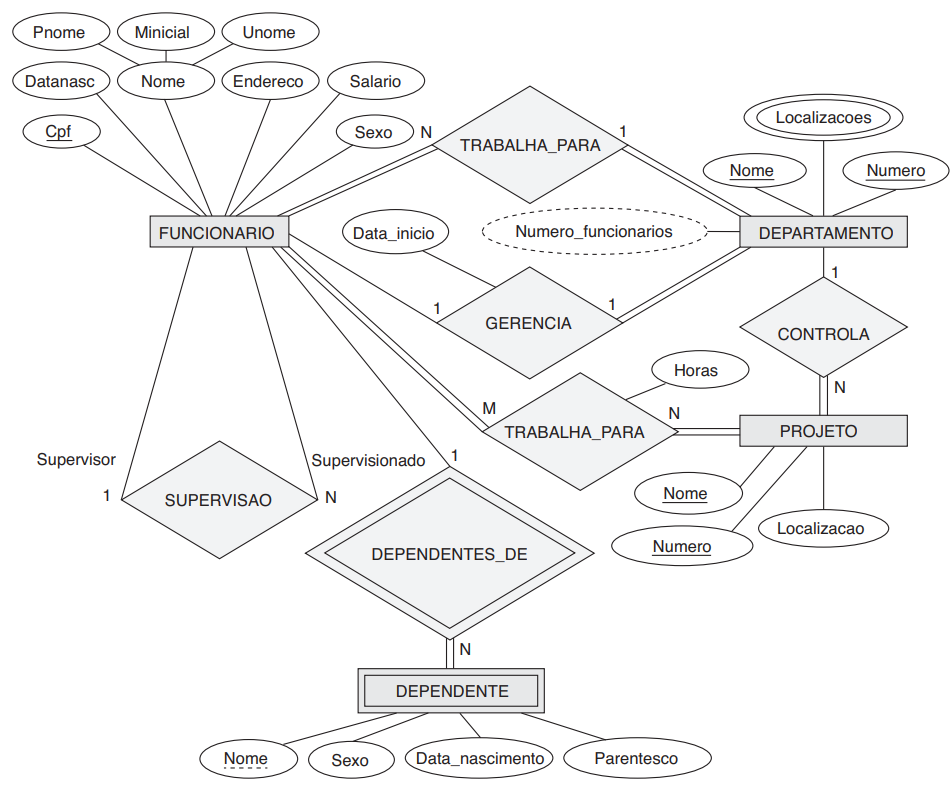
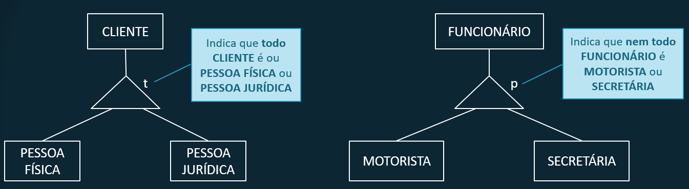

# **Banco de dados**
## Aula 03
### Modelo Entidade Relacionamento
Felipe Marx Benghi
https://github.com/fbenghi/BancoDeDados2023-2

---

# Objetivos
- [x] Níveis de abstração de dados (conceitual, lógico e físico)
- [x] Modelo Entidade Relacionamento

---

## Por que modelar?
> O projeto de um sistema de informações é uma atividade complexa que inclui planejamento, especificações e desenvolvimento de vários componentes. A utilização de uma abordagem correta de metodologia orientada a banco de dados envolve a estruturação nos três níveis de visão de dados: conceitual, lógico e físico.”
(MACHADO e ABREU, 2004, p. 26)

---
# Objetivos da Modelagem
1. Levantamento das necessidades dos usuários (requisitos);
1. Especificar de **modo sistemático** a necessidades dos usuários de banco de dados;
1. Estruturar o banco de dados de forma a atender plenamente todas as necessidades.

<!-- ---
# Projeto de Software
 -->

---
## 3 Níveis de Modelagem de Banco de Dados

1. Nível Conceitual – **representação do mundo real**. Define quais dados aparecerão no BD e como eles se relacionam, mas sem se importar com a implementação no SGBD.

1. Nível Lógico – nível do **SGBD**, ou seja, depende do tipo particular de SGBD que será usado (relacional, orientado a objetos...).

1. Nível Físico – descreve como esses dados estarão de fato armazenados, partição de discos etc. É onde os dados existem / são gravados.

---
## Nível Conceitual

* O Projeto Conceitual produz um esquema conceitual a partir de requisitos de um mundo real
* Registra quais dados devem aparecer, mas não como;
* É independente do SGBD escolhido.
* Composto por Entidades, Atributos e Relacionamentos

### Exemplos:
* Dados de uma Pessoa com os seguintes atributos: Nome, RG, CPF, Rua, Numero, Cidade;
* Dados de um Livro com os seguintes atributos: Titulo, Autores, ISBN, Editora, Ano_Publicacao, Qtde_Paginas.

---
## Entidade

* Objeto do mundo real, concreto ou abstrato e que possui existência independente;
* Objeto da realidade modelada sobre os quais deseja-se manter informações no banco de dados; 

### Exemplos:
* Pessoa, Produto, Venda, Aluno, Professor. 

---
## Atributo
* Cada entidade possui um conjunto particular de propriedades que a descreve chamado atributos.

### Exemplos:
* Entidade Pessoa pode conter os atributos: Nome, Endereço, RG, CPF, Telefone...
* Entidade Produto, pode conter os atributos: Nome, Peso, Valor_Unitário...

---
## Relacionamento
* Conjunto de associações entre ocorrências de entidades;

---
## Relacionamento
Cada tipo entidade que participa de um tipo relacionamento desempenha um papel particular no relacionamento.

---
## Diagrama Entidade Relacionamento
O Diagrama Entidade-Relacionamento (DER) é composto por um conjunto de objetos gráficos que visam representar todos os objetos do modelo Entidade Relacionamento 

 
 

---
### Exemplo

Precisamos criar o banco de dados para uma EMPRESA, sabendo que:
* A empresa é organizada em departamentos. Cada departamento tem um nome exclusivo e um número exclusivo.
* Um departamento controla uma série de projetos, cada um deles com um nome exclusivo, um número exclusivo e um orçamento exclusivo
* Funcionários: armazenamos o nome, número do CPF, endereço, salário. Um funcionário trabalha para um departamento, mas pode trabalhar em vários projetos, que não necessariamente são controlados pelo mesmo departamento

---
## Diagrama Entidade-Relacionamento

---
## Diagrama Entidade Relacionamento
### Cardinalidade
A razão de cardinalidade para um relacionamento binário especifica o número máximo de instâncias de relacionamento em que uma entidade pode participar
* Um para um – 1:1 
* Um para muitos – 1:N
* Muitos para um – N:1
* Muitos para muitos – N:N ou N:M

---

#### Exemplo 1:N
>  Cada departamento pode estar relacionado a qualquer número de funcionários, mas um funcionário só pode estar relacionado a (trabalha para) um departamento

Opções:
* Um para um – 1:1 
* Um para muitos – 1:N
* Muitos para um – N:1
* Muitos para muitos – N:N ou N:M

1:N :arrow_right: Muitos [N] Funcionários trabalham para [1] Departamento
  

---

## Exemplo: 
Qual a cardinalidade dos outros relacionamentos no exemplo da empresa Empresa?

<!-- ---
## Cardinalidade
Notação alternativa:
 -->

---
## Tipos de Atributos
* Atributo Simples ou Atômico: atributo que não pode ser subdividido. Ex.: Título (Sr./Sra), Sexo.
* Atributo Composto: atributo que pode ser dividido em diversas subpartes com significado independente entre si. Ex.: Endereço (pois é composto por Tipo do Logradouro, Logradouro, Numero, Bairro, CEP).
* Atributo Derivado: atributo que é gerado a partir de outro atributo, muitas vezes por meio de processamento no banco de dados. Ex.: Quantidade de alunos, Total de vendas.
* Atributo Chave: toda entidade deve ter ao menos um atributo que permita identificá-la de forma única. Ex.: RG, CPF, Código.
* Atributo multivalorado: pode possuir simultaneamente mais de um valor. Exemplo: formação acadêmica

---
## Continuando o exemplo...
Quais os tipos de atributos no exemplo?

---
## Entidade Fraca
* Precisam estar relacionadas a uma outra entidade, que é chamada de **entidade proprietária**

* Este relacionamento é chamado de **relacionamento identificador**

* Não possuem atributos-chave próprios
* Podem possuir uma chave-parcial

---

## Continuando o exemplo...
* Queremos registrar os dependentes de cada funcionário para fins de plano de saúde. Para cada dependente, mantemos o nome, sexo, data de nascimento e parentesco com o funcionário

---

---

## Continuando o exemplo...

* Cada departamento tem um nome exclusivo, um número exclusivo e um funcionário em particular que o gerencia. 
* Todo funcionário tem um supervisor direto (que é outro funcionário)

---
# Descrição completa do problema
- A empresa é organizada em departamentos. Cada departamento tem um nome exclusivo, um número exclusivo e um funcionário em particular que o gerencia. Registramos a data inicial em que esse funcionário começou a gerenciar o departamento. Um departamento pode ter vários locais.
- Um departamento controla uma série de projetos, cada um deles com um nome exclusivo, um número exclusivo e um local exclusivo.

---

- Armazenamos o nome, número do Cadastro de Pessoa Física, endereço, salário, sexo (gênero) e data de nascimento de cada funcionário. Um funcionário é designado para um departamento, mas pode trabalhar em vários projetos, que não necessariamente são controlados pelo mesmo departamento. Registramos o número atual de horas por semana que um funcionário trabalha em cada projeto. Também registramos o supervisor direto de cada funcionário (que é outro funcionário).
- Queremos registrar os dependentes de cada funcionário para fins de seguro. Para cada dependente, mantemos o nome, sexo, data de nascimento e parentesco com o funcionário.

---

---
## Relacionamentos n-ésimos
* A abordagem ER permite que sejam definidos relacionamentos de grau maior do que dois, ou seja que relacione mais que duas entidades;
* São chamados de relacionamentos ternários, quando envolvem 3 entidades; quaternários quando envolvem 4 entidades, ...
* É sempre possível recompor um conjunto de relacionamentos não binários (n-ésimos, n -> 2) por um conjunto de relacionamentos binários distintos.

---
## Relacionamentos n-ésimos

---
## Especialização x Generalização
* Propriedades podem ser atribuídas a entidades através do conceito de generalização/especialização;
* Através deste conceito é possível atribuir propriedades particulares a um subconjunto das ocorrências (especializadas) de uma entidade genérica;
* O símbolo para representar generalização/especialização é um triângulo isósceles.

---
## Especialização x Generalização

---
## Especialização x Generalização

---
# FIM
---