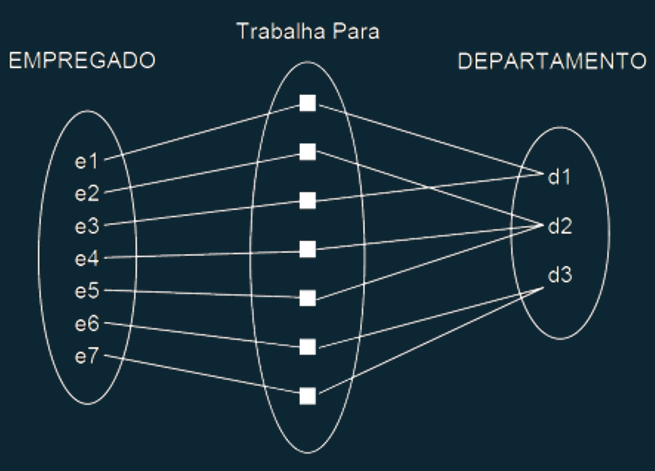
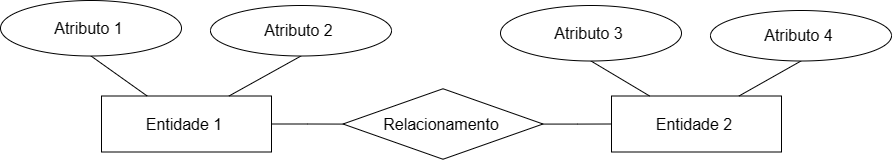
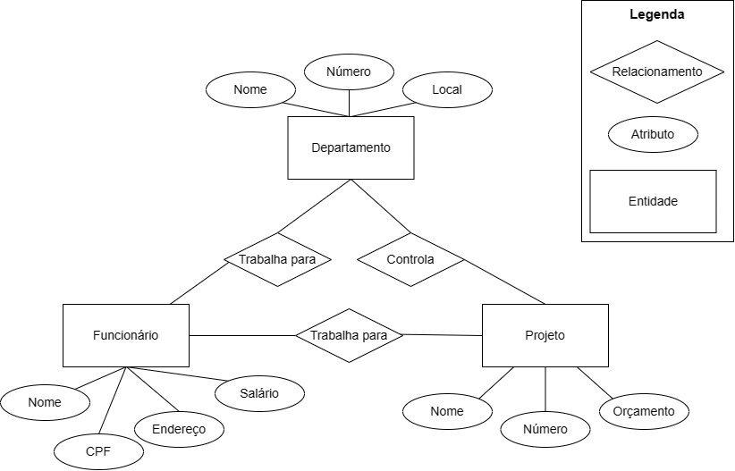
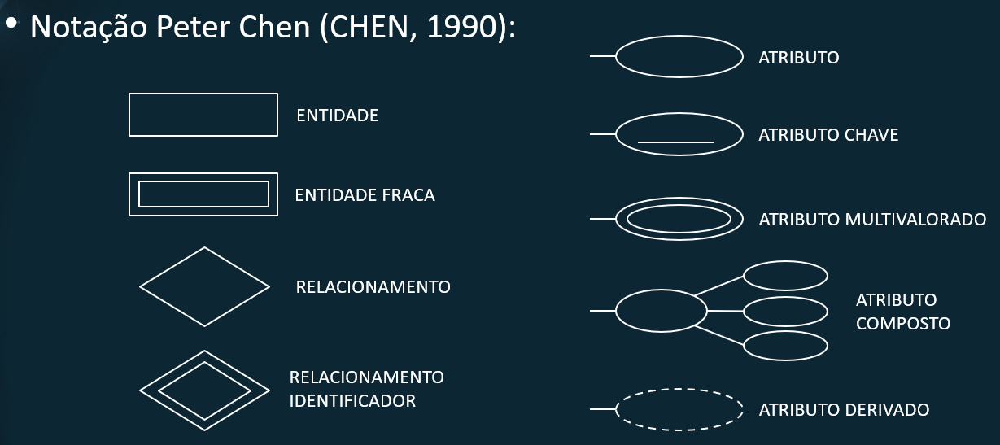
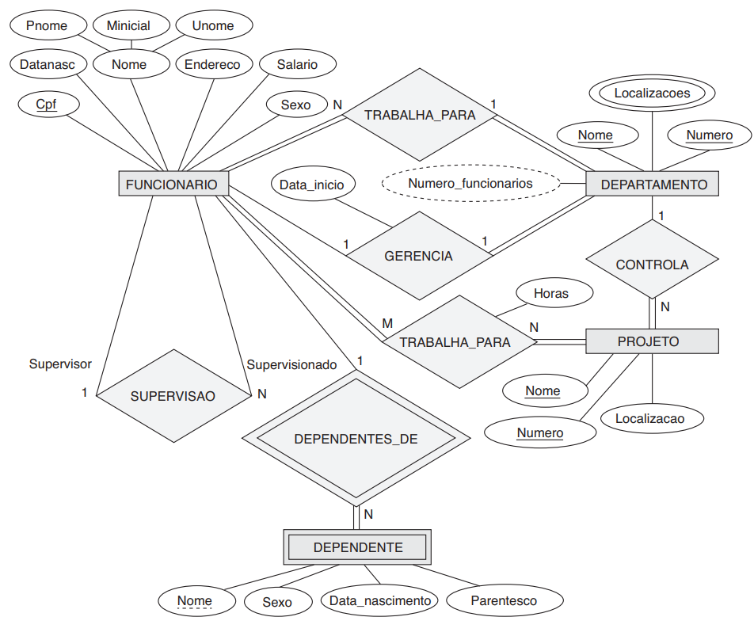

# **Banco de dados**
## Revisão
### Modelo Entidade Relacionamento
Felipe Marx Benghi
https://github.com/fbenghi/BancoDeDados2023-2

---
## Entidade

* Objeto do mundo real, concreto ou abstrato e que possui existência independente;
* Objeto da realidade modelada sobre os quais deseja-se manter informações no banco de dados; 

### Exemplos:
* Pessoa, Produto, Venda, Aluno, Professor. 

---
## Atributo
* Cada entidade possui um conjunto particular de propriedades que a descreve chamado atributos.

### Exemplos:
* Entidade Pessoa pode conter os atributos: Nome, Endereço, RG, CPF, Telefone...
* Entidade Produto, pode conter os atributos: Nome, Peso, Valor_Unitário...

---
## Relacionamento
* Conjunto de associações entre ocorrências de entidades;

---
## Diagrama Entidade Relacionamento
O Diagrama Entidade-Relacionamento (DER) é composto por um conjunto de objetos gráficos que visam representar todos os objetos do modelo Entidade Relacionamento 

 
 

---
### Exemplo

Precisamos criar o banco de dados para uma EMPRESA, sabendo que:
* A empresa é organizada em departamentos. Cada departamento tem um nome exclusivo e um número exclusivo.
* Um departamento controla uma série de projetos, cada um deles com um nome exclusivo, um número exclusivo e um orçamento exclusivo
* Funcionários: armazenamos o nome, número do CPF, endereço, salário. Um funcionário trabalha para um departamento, mas pode trabalhar em vários projetos, que não necessariamente são controlados pelo mesmo departamento

---
## Diagrama Entidade-Relacionamento

---
## Diagrama Entidade Relacionamento
### Cardinalidade
A razão de cardinalidade para um relacionamento binário especifica o número máximo de instâncias de relacionamento em que uma entidade pode participar
* Um para um – 1:1 
* Um para muitos – 1:N
* Muitos para um – N:1
* Muitos para muitos – N:N ou N:M

---

## Continuando o exemplo...
Quais a cardinalidade nos relacionamentos?

---
## Tipos de Atributos
* Atributo Simples ou Atômico: atributo que não pode ser subdividido. Ex.: Título (Sr./Sra), Sexo.
* Atributo Composto: atributo que pode ser dividido em diversas subpartes com significado independente entre si. Ex.: Endereço (pois é composto por Tipo do Logradouro, Logradouro, Numero, Bairro, CEP).
* Atributo Derivado: atributo que é gerado a partir de outro atributo, muitas vezes por meio de processamento no banco de dados. Ex.: Quantidade de alunos, Total de vendas.
* Atributo Chave: toda entidade deve ter ao menos um atributo que permita identificá-la de forma única. Ex.: RG, CPF, Código.
* Atributo multivalorado: pode possuir simultaneamente mais de um valor. Exemplo: formação acadêmica

---
## Continuando o exemplo...
Quais os tipos de atributos no exemplo?

---
## Entidade Fraca
* Precisam estar relacionadas a uma outra entidade, que é chamada de **entidade proprietária**

* Este relacionamento é chamado de **relacionamento identificador**

* Não possuem atributos-chave próprios
* Podem possuir uma chave-parcial

---

## Continuando o exemplo...
* Queremos registrar os dependentes de cada funcionário para fins de plano de saúde. Para cada dependente, mantemos o nome, sexo, data de nascimento e parentesco com o funcionário

---

---

## Continuando o exemplo...

* Cada departamento tem um nome exclusivo, um número exclusivo e um funcionário em particular que o gerencia. 
* Todo funcionário tem um supervisor direto (que é outro funcionário)

---
# Descrição completa do problema
- A empresa é organizada em departamentos. Cada departamento tem um nome exclusivo, um número exclusivo e um funcionário em particular que o gerencia. *Registramos a data inicial em que esse funcionário começou a gerenciar o departamento. Um departamento pode ter vários locais.*
- Um departamento controla uma série de projetos, cada um deles com um nome exclusivo, um número exclusivo e um local exclusivo.

---

- Armazenamos o nome, número do Cadastro de Pessoa Física, endereço, salário, sexo (gênero) e data de nascimento de cada funcionário. Um funcionário é designado para um departamento, mas pode trabalhar em vários projetos, que não necessariamente são controlados pelo mesmo departamento. *Registramos o número atual de horas por semana que um funcionário trabalha em cada projeto.* Também registramos o supervisor direto de cada funcionário (que é outro funcionário).
- Queremos registrar os dependentes de cada funcionário para fins de seguro. Para cada dependente, mantemos o nome, sexo, data de nascimento e parentesco com o funcionário.

---

---
# FIM
