# **Banco de dados**
## Aula 04
### Modelo Entidade Relacionamento
Felipe Marx Benghi
https://github.com/fbenghi/BancoDeDados2023-2

---

# Objetivos
- [x] Transformação de Modelo Conceitual para Modelo Lógico. 
- [x] Chaves primárias e chaves estrangeiras
- [x] Normalização. 

---
## Projeto Lógico
* É construído a partir do Projeto Conceitual, gerando nesta etapa o modelo lógico;
* O modelo lógico é dependente do paradigma do SGBD que será adotado (Relacional, O.O., ...);
* A grande maioria dos SGBDs atuais ainda são relacionais 

--- 

## Modelo Lógico Relacional

* O modelo relacional representa os dados de um BD como uma coleção de tabelas (relações);
* Uma tabela é composta por linhas e colunas, sendo que as colunas são os atributos (campos) e as linhas são chamadas de tuplas, que representam os registros.

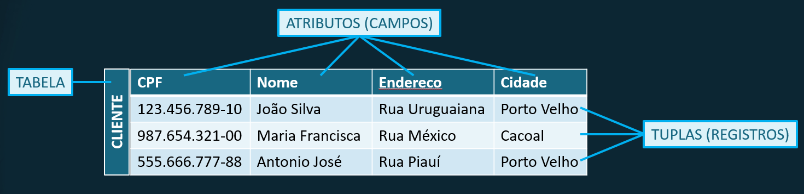

---

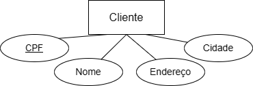

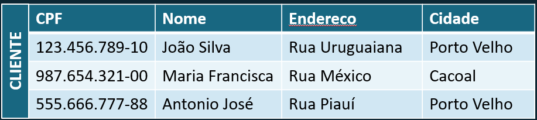

---
## Modelo Lógico Relacional
Para criar uma tabela, deve-se designar:
* Um nome, que será único;
* Um conjunto de atributos com seus respectivos nomes e domínios;
* Um domínio D é um conjunto de valores atômicos (indivisíveis). Ex.:
    * Fone: conjunto de 10 dígitos
    * CPF: conjunto de 11 dígitos
    * Idade: 16 ≤ idade ≤70
* Chaves
---
## Chaves
* Uma tabela irá conter inúmeras linhas (virtualmente infinitas);
* Para se referenciar distintamente a cada linha, é necessário definir sua **chave primária** (PK – primary key);
* Uma chave pode ser um único atributo ou um conjunto de atributos;

---
## Chaves
* Chaves candidatas: ocorre quando uma tabela que possui mais de uma possível chave primária. Exemplo: RG e CPF para uma pessoa
* Normalmente uma destas chaves candidatas será escolhida como **chave primária**.
  

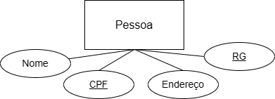

---
## Chave Estrangeira
* Uma Chave Estrangeira (FK – foreign key) especifica um relacionamento entre as tabelas.
 

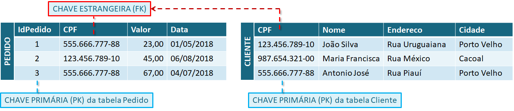

---
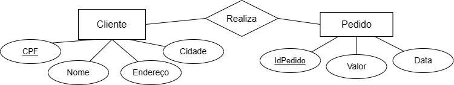

---
## Diagrama do modelo lógico relacional
* Segue-se a simbologia da UML (Unified Modeling Language – Linguagem de Modelagem Unificada):
* O mapeamento do Modelo Entidade relacionamento para o Modelo Relacional segue alguns passos básicos
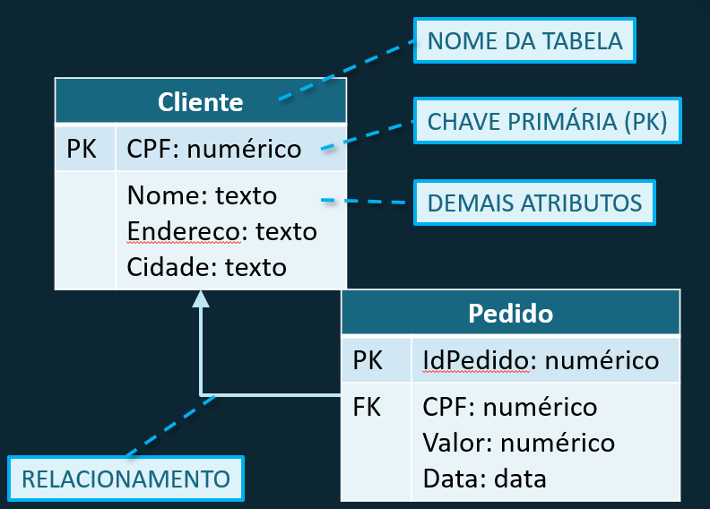

---
## 1º Passo
* Para cada *Entidade Forte* é criada uma **Tabela** que inclui todos os atributos simples da Entidade;
* Para cada *Atributo Composto*, são inseridos apenas os componentes simples;
* Um dos *Atributos chaves* deve ser escolhida como a **Chave Primária** da Tabela.

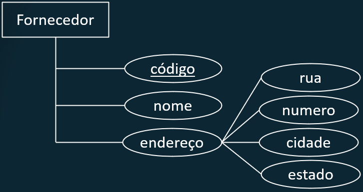

---
## 1º Passo
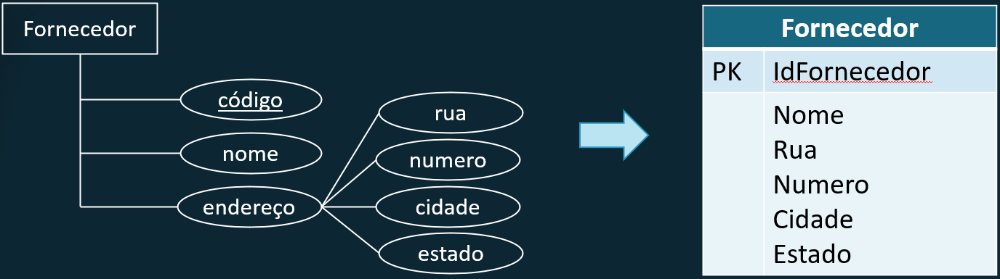

---
## 2º passo
* Para cada *Entidade Fraca* com **Entidade Proprietária**, é criada uma Tabela que inclui todos os atributos simples da *Entidade Fraca*.
* Para cada *Atributo Composto*, são inseridos apenas os *Atributos Componentes Simples*; 
* A **Chave Primária** será composta pela *Chave Parcial* da *Entidade Fraca* mais a chave primária da *Entidade Proprietária*.

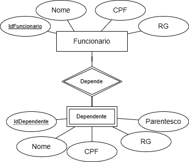

---

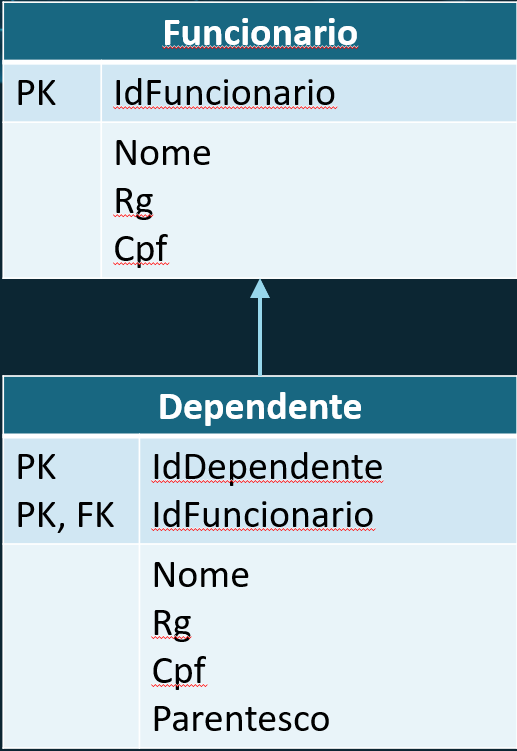

---
## 3º passo
* Para cada relacionamento regular com cardinalidade 1:1, devemos escolher a chave primária de uma das relações e inseri-la como chave estrangeira na outra tabela
* Se um dos lados do relacionamento tiver participação total e outro parcial, então é interessante que a chave do lado com participação parcial seja inserida como chave estrangeira no lado que tem participação total.
 

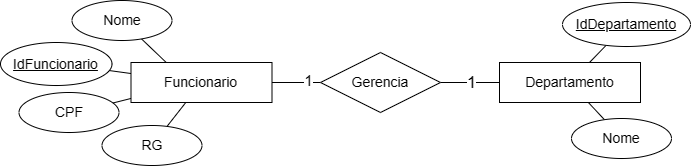

---

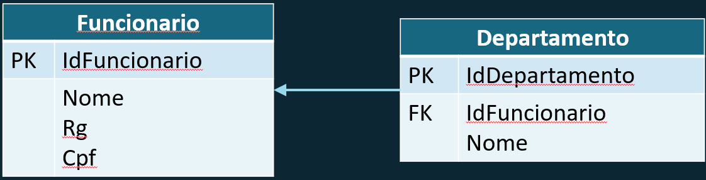

---
## 4º passo
* Para cada relacionamento regular com cardinalidade 1:N, deve-se inserir a Chave Primária da Entidade com menor cardinalidade (1) como Chave Estrangeira na Tabela referente a entidade de maior cardinalidade (N).
 
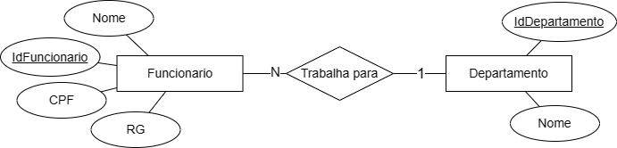

---

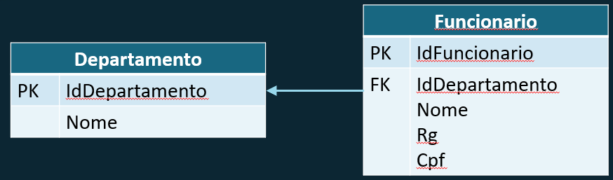

---
## 5º passo
* Para cada relacionamento regular com cardinalidade N:N, cria-se uma nova Tabela, contendo todos os atributos do relacionamento mais a chave primária das duas Tabelas.
* A Chave Primária da nova Tabela será composta pelos Atributos Chave das duas Tabelas que a originaram .

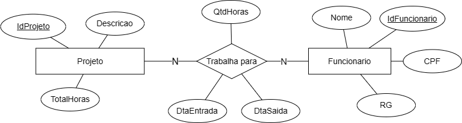

---

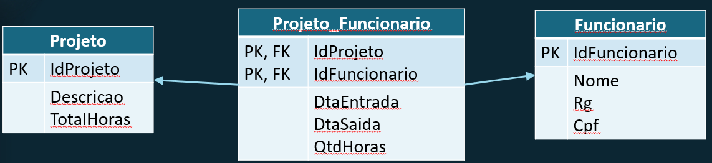

--- 
## 6º passo
* Para cada atributo multivalorado, cria-se uma nova  Tabela, contendo o atributo multivalorado
* A Chave Primária da nova Tabela  será composta pela Chave-Primária da Tabela que representa a Entidade a que o atributo multivalorado pertencia originalmente e a Chave-Primária da nova tabela;

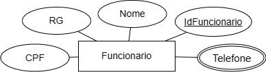

---

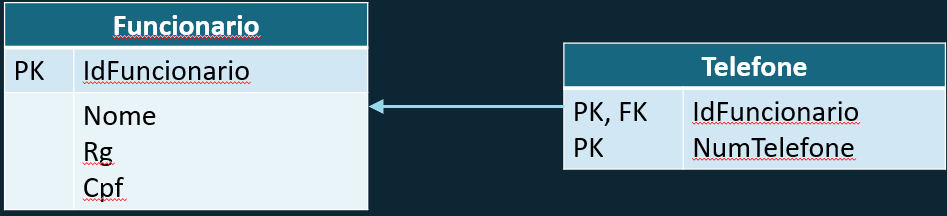

---
## 6º passo (continuação)
* Se o Atributo Multivalorado for composto, então a tabela deverá conter todos os atributos simples.

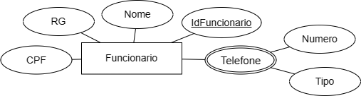

---

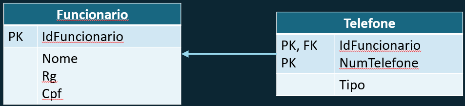

---
# Normalização
O processo de normalização em que são eliminados esquemas de relações (tabelas) não satisfatórios, decompondo-os, através da separação de seus atributos em esquemas de relações menos complexas, mas que satisfaçam as propriedades desejadas.

Pode ser considerado um processo de 'filtragem' para fazer que o projeto tenha uma qualidade cada vez melhor.

---
## Objetivos
A normalização busca:
* Garantir que a semântica dos atributos seja clara (não dúbia).
* Grupos repetitivos (redundantes) de dados;
* Valores NULOS nos registros;
* Dificuldade na apresentação de fatos da realidade observada;

---

## Quais os 2 problemas com a tabela abaixo?
Devemos armazenar telefone e endereço de cada cliente.
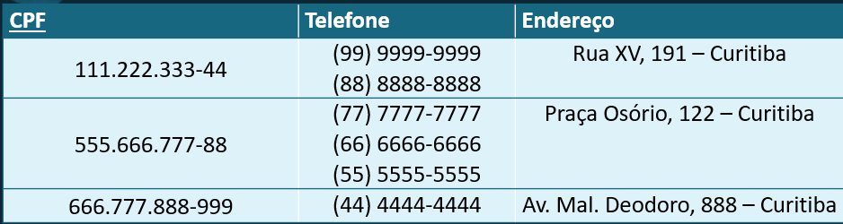

---

# 1ª forma normal (1FN)
* Uma relação está na 1FN se os valores de seus atributos são atômicos (simples, indivisíveis) e monovalorados;

Logo, a Tabela do slide anterior **NÃO** está na 1FN.

---
## 1ª forma normal (1FN)
Procedimento para **atributos compostos**:
1. Remova o atributo composto e coloque em uma nova tabela separada, junto com a chave primária.
1. Decomponha o atributo composto em atributos atômicos

Procedimentos para **atributos multivalorados**:
1. Remova o atributo multivalorado e coloque-o em uma nova tabela, repita a chave primária da tabela original.
1. Use os atributo multivalorado como chave primária.
* A chave primária será a combinação dos dois atributos.
---

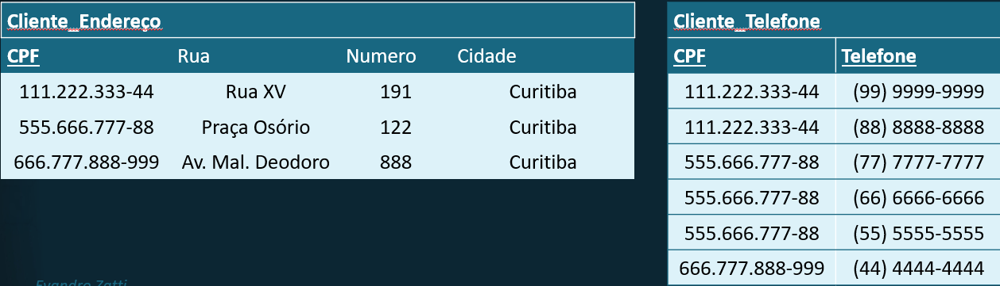

---
## Qual o problema da tabela abaixo?
A tabela foi criada para indicar a quantidade de produtos por pedido

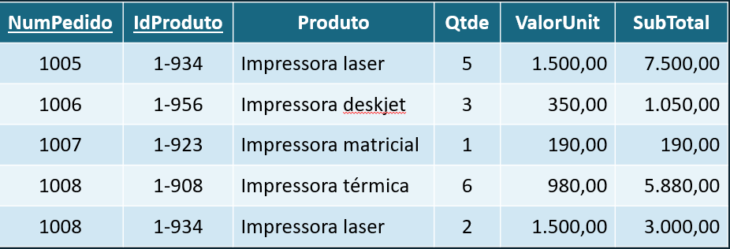

---
## 2ª forma normal (2FN)
Uma relação está na segunda forma normal quando duas condições são satisfeitas:
* a relação estiver na primeira forma normal;
* todo atributo não chave for **totalmente** dependente da chave primária.

Se a chave primária tiver um único atributo, não é preciso testar a 2FN.

---
## 2ª forma normal (2FN)
### Dependências Funcionais:
* O nome do produto depende de IdProduto (código identificador do produto), porém não depende de NumPedido, que é a chave primária da tabela
> Portanto, não está na 2FN.

Problemas: se houver alteração no nome do produto terá que se alterar em todos os registros da tabela venda.

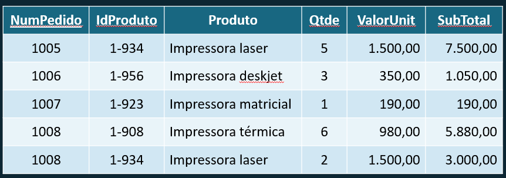

---
## 2ª forma normal (2FN)
Procedimentos:
1. Identificar os atributos que não são funcionalmente dependentes de **toda** a chave primária;
1. Remover da tabela todos esses atributos identificados e criar uma nova tabela;
1. A chave primária da nova tabela será o atributo do qual os atributos removidos são funcionalmente dependentes.

---

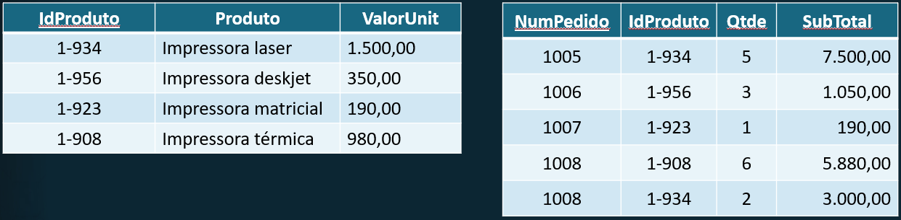

---
## Qual o problema da tabela abaixo?
A tabela foi criada para indicar os vencedores de um conjunto de torneios anuais. Exemplo (Série A - Índice `1`, B  - Índice `2` e C - Índice `3`)
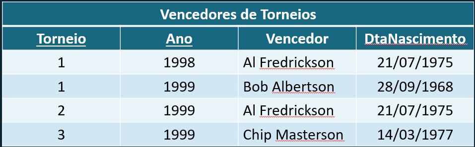

---

## 3ª forma normal (3FN)
Uma relação está na 3FN duas condições forem satisfeitas:
* Estiver na 2FN.
* Nenhum atributo não-chave depender de outra coluna não-chave.

---
## 3ª forma normal (3FN)
Procedimentos:
1. Identificar os atributos que não são dependentes da chave primária;
1. Remover da tabela todos esses atributos identificados e criar uma nova tabela;
1. A chave primária da nova tabela será o atributo do qual os atributos removidos são dependentes.
1. A nova chave primária deve ser incluída na tabela inicial

---

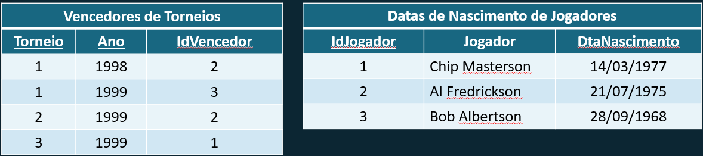

---
# FIM
