# **Banco de dados**
## Aula 05
### Projeto Físico
Felipe Marx Benghi
https://github.com/fbenghi/BancoDeDados2023-2


---

# Objetivos
- [x] Projeto Físico
- [x] Tipos de dados
- [x] Modelagem com workbench (Lógico Relacional e Físico)

---
## Projeto Físico
### Conceito
> Define-se como modelo físico de dados aquele em que a representação dos objetos é feita sob o foco do nível físico de implementação das ocorrências, ou instâncias das entidades e seus relacionamentos. [...] Cada SGBD poderá definir um diferente modo de implementação física das características e recursos necessários para o armazenamento e manipulação das estruturas de dados.”
(COUGO, 1997, p. 30)


--- 
## Projeto Físico
* É a descrição da implementação da base de dados em memória secundária.
* Descreve estruturas de armazenamento e métodos de acesso.
* No modelo físico é feita a modelagem física do modelo de banco de dados.
* Leva-se em conta as limitações impostas pelo SGBD escolhido e deve ser criado sempre com base nos exemplos de modelagem de dados produzidos no modelo lógico.

--- 
## Projeto Físico (Exemplo)
### Colunas
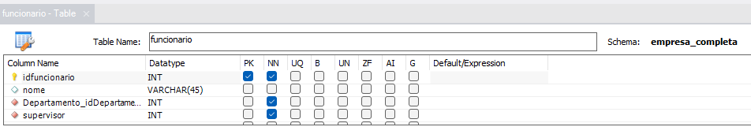

### Chaves Estrangeiras
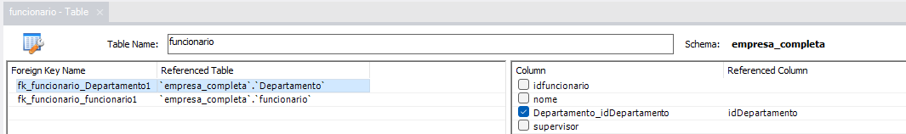

--- 
## Tipos de dados
É necessário conhecer os tipos de dados do SGBD escolhido para que se faça a transposição a partir do modelo lógico, já considerando especificidades e limitações técnicas.

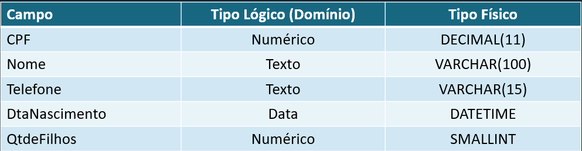

---
<!-- _class: small-font -->

|SGBD | Fabricante | Referência para os tipos de dados|
|-|-|-|
|ASE (antigo Sybase) | SAP | https://infocenter.sybase.com/help/index.jsp?topic=/com.sybase.infocenter.dc32300.1600/|doc/html/san1390612189202.html |
|DB2 | IBM | https://www.ibm.com/docs/en/db2-for-zos/12?topic=columns-data-types |
|MS SQL Server | Microsoft | https://learn.microsoft.com/en-us/sql/t-sql/data-types/data-types-transact-sql?|view=sql-server-ver16 |
|MySQL | Oracle | https://dev.mysql.com/doc/refman/8.0/en/data-types.html |
|Oracle Database | Oracle | https://docs.oracle.com/en/database/oracle/oracle-database/19/sqlrf/Data-Types.|html#GUID-A3C0D836-BADB-44E5-A5D4-265BA5968483 |
|PostgreSQL | PostgreSQL GDG | https://www.postgresql.org/docs/current/datatype.html |
|SQLite* | Richard Hipp | https://www.sqlite.org/draft/datatype3.html |

---
<!-- _class: small-font -->
## MySQL - Dados Numéricos (inteiros)

|Tipo | Descrição |
|-|-|
| INT(tamanho) | Um número inteiro. Quando "com sinal" tem intervalo de -2.147.483.648 a 2.147.483.647. O intervalo "sem sinal" tem 4.294.967.295. O parâmetro *tamanho* especifica a largura máxima de exibição (que é 255). Valor padrão para o parâmetro *tamanho* é 1. |
| BOOL ou BOOLEAN | Zero é considerado *falso*, valores diferentes de zero são considerados *verdadeiros*. |
| TINYINT(tamanho)  | Inteiro com intervalo "com sinal" de -128 a 127. O intervalo *sem sinal* é de 0 a 255.  |
| SMALLINT(tamanho) | Inteiro com intervalo "com sinal" de -32.768 a 32.767. O intervalo *sem sinal* é de 0 a 65.535. |
| MEDIUMINT(tamanho) | Inteiro com intervalo "com sinal" de -8.388.608 a 8.388.607. O intervalo *sem sinal* é de 16.777.215. |
| BIGINT(tamanho) | Inteiro com intervalo "com sinal" de -9.223.372.036.854.775.808 a 9.223.372.036.854.775.807.  O intervalo *sem sinal* é de 0 a 18.446.744.073.709.551.615. |

---
<!-- _class: small-font -->
## MySQL - Dados Numéricos (inteiros)
|Type | Armazenamento (Bytes) | Valor Min (Signed) | Valor Min Unsigned | Valor Max (Signed) | Valor Max (Unsigned) | 
|-|-|-|-|-|-|
|TINYINT    | 1 | -128 | 0 | 127 | 255| 
|SMALLINT   | 2 | -32.768 | 0 | 32.767 | 65.535| 
|MEDIUMINT  | 3 | -8.388.608 | 0 | 8.388.607 | 16.777.215| 
|INT        | 4 | -214.7483.648 | 0 | 2147483647 | 4.294.967.295| 
|BIGINT     | 8 | -2^63 | 0 | (2^63)-1 | (2^64)| 

---
<!-- _class: small-font -->
## MySQL - Dados Numéricos (não-inteiros)
|Tipo | Descrição |
|-|-|
| FLOAT(p) | Um número de ponto flutuante. MySQL usa o valor p para determinar se deve usar FLOAT ou DOUBLE para o tipo de dados resultante. Se p for de 0 a 24, o tipo de dados se torna FLOAT(). Se p for de 25 a 53, o tipo de dados se torna DOUBLE(). Para FLOAT, o número máximo "sem sinal" é 3.402823466E+38 |
| DOUBLE | Um número de ponto flutuante com 8 bytes (dobro do float). Valor máximo "sem sinal" é  3.402823466E+38 |
| DECIMAL ou DEC(tamanho, d) | Um número exato de ponto fixo. O número total de dígitos é especificado em tamanho. O número de dígitos após o ponto decimal é especificado no parâmetro d. O número máximo para tamanho é 65. O número máximo para d é 30. O valor padrão para tamanho é 10. O valor padrão para d é 0. |

---
<!-- _class: small-font -->
## MySQL - Dados de texto (string)
|Tipo | Descrição |
|-|-|
| CHAR(tamanho) | Uma string de comprimento FIXO (pode conter letras, números e caracteres especiais). O parâmetro size especifica o comprimento da coluna em caracteres - pode ser de 0 a 255. O padrão é 1 |
| VARCHAR(tamanho) | Uma string de comprimento VARIÁVEL (pode conter letras, números e caracteres especiais). O parâmetro size especifica o comprimento máximo da coluna em caracteres - pode ser de 0 a 65535 |
| TEXT(tamanho) | Contém uma string com comprimento máximo de 65.535 bytes - Existem as opções TYNY, MEDIUM, LONG |

---
<!-- _class: small-font -->
## MySQL - Dados de texto (binários)
|Tipo | Descrição |
|-|-|
| BINARY(tamanho) | Igual a CHAR(), mas armazena strings de bytes binários. O parâmetro size especifica o comprimento da coluna em bytes. O padrão é 1. |
| VARBINARY(tamanho) | Igual a VARCHAR(), mas armazena strings de bytes binários. O parâmetro size especifica o comprimento máximo da coluna em bytes. |
| BLOB(tamanho) | Para BLOBs (objetos binários grandes). Armazena até 65.535 bytes de dados - Existem as opções TYNY, MEDIUM, LONG |

---
<!-- _class: small-font -->
## MySQL - Dados de texto (binários)
|Tipo | Descrição |
|-|-|
| ENUM(val1, val2, val3, ...) | Um objeto string que pode ter apenas um valor, escolhido em uma lista de valores possíveis. Você pode listar até 65.535 valores em uma lista ENUM. Caso seja inserido um valor que não esteja na lista, será inserido um valor em branco. Os valores são classificados na ordem em que você os insere |
| SET(val1, val2, val3, ...) | Um objeto string que pode ter 0 ou mais valores, escolhidos em uma lista de valores possíveis. Você pode listar até 64 valores em uma lista SET |

---
# Diagrama UML
É comum que a estrutura de uma base de dados seja apresentada na forma de um diagrama com base na UML, no qual são registradas as tabelas e relacionamentos entre elas;

---
# Diagrama UML
* campos necessários (não aceitam nulo) estão em negrito
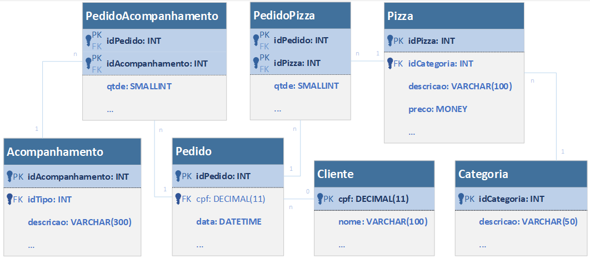

---
## SQL DDL
A implementação física do banco de dados é descrita por meio de um conjunto específico de comandos SQL:a SQL DDL (Data Definition Language – Linguagem de Definição de Dados);
Nela, são utilizados termos específicos para criação de tabelas, definições de chaves, tipos etc.

```
CREATE TABLE IF NOT EXISTS `empresa_completa`.`Departamento` (
  `idDepartamento` INT NOT NULL,
  `nome` VARCHAR(45) NULL,
  `funcionario_idfuncionario` INT NOT NULL,
  PRIMARY KEY (`idDepartamento`),
  INDEX `fk_Departamento_funcionario_idx` (`funcionario_idfuncionario` ASC) VISIBLE,
  CONSTRAINT `fk_Departamento_funcionario`
    FOREIGN KEY (`funcionario_idfuncionario`)
    REFERENCES `empresa_completa`.`funcionario` (`idfuncionario`)
    ON DELETE NO ACTION
    ON UPDATE NO ACTION)
ENGINE = InnoDB;
```

---
# Modelagem no Workbench

---
## Lógico Relacional

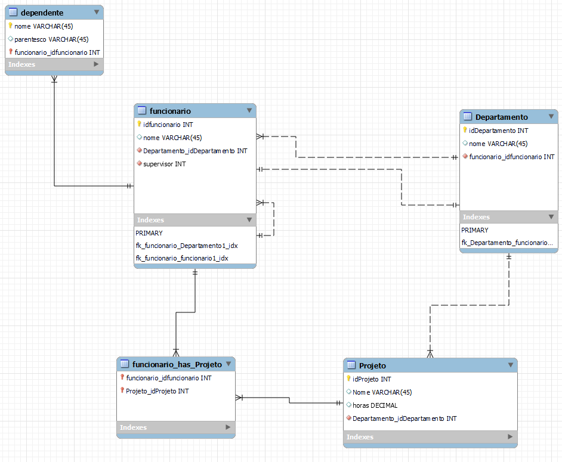

---
## Projeto Lógico Relacional
### Notas
* Non-identifying relationship: chave estrangeira **não** é usada como chave primária (linhas pontilhadas)
* Identifying relationship: chave estrangeira **é** usada como chave primária (linhas contínuas)

---
## Projeto Físico
### Colunas
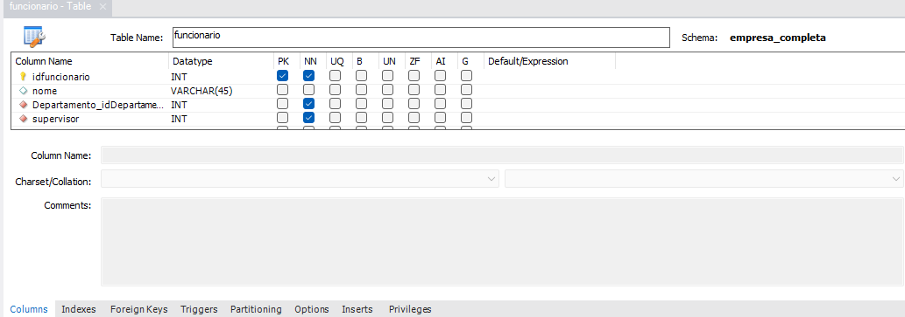

---
## Projeto Físico
### Índices (index)
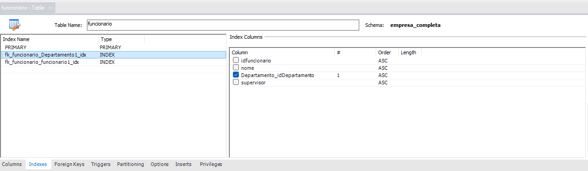

---
## Projeto Físico
### Chaves estrangeiras (Foreign Key - FK)
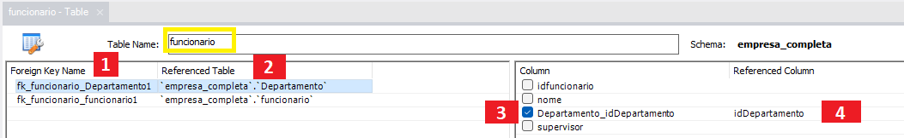
Para a tabela funcionario:
1. Nome da chave, pode ser qualquer valor desde não repetido
1. Qual tabela será referenciada (departamento)
1. Nome da coluna da tabela que está se editando (funcionário)
1. Nome da coluna na tabela que será referenciada (idDepartamento em departamento)

---
## Projeto Físico
### Determinando onde as tabelas vão ser salvas
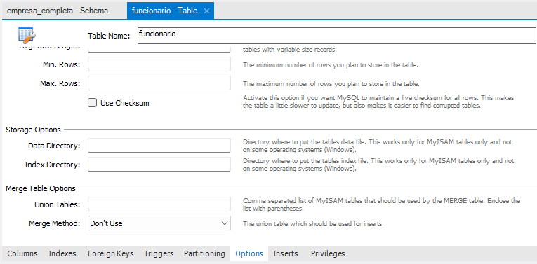

---
### Para editar o nome do esquema
1. Dois cliques sobre o nome do esquema
1. Editar o nome

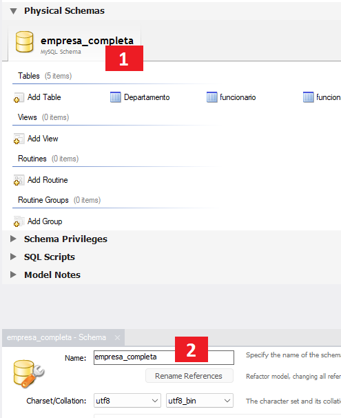

---
### Para criar as tabelas
Database > Forward Engineer

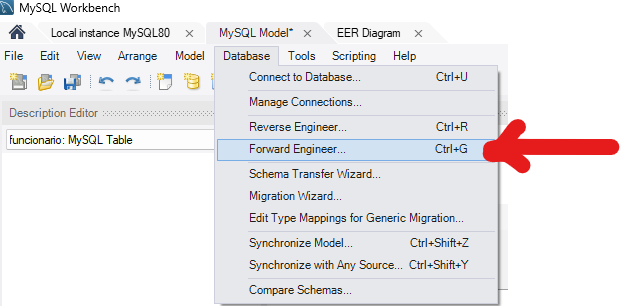


---
# FIM


