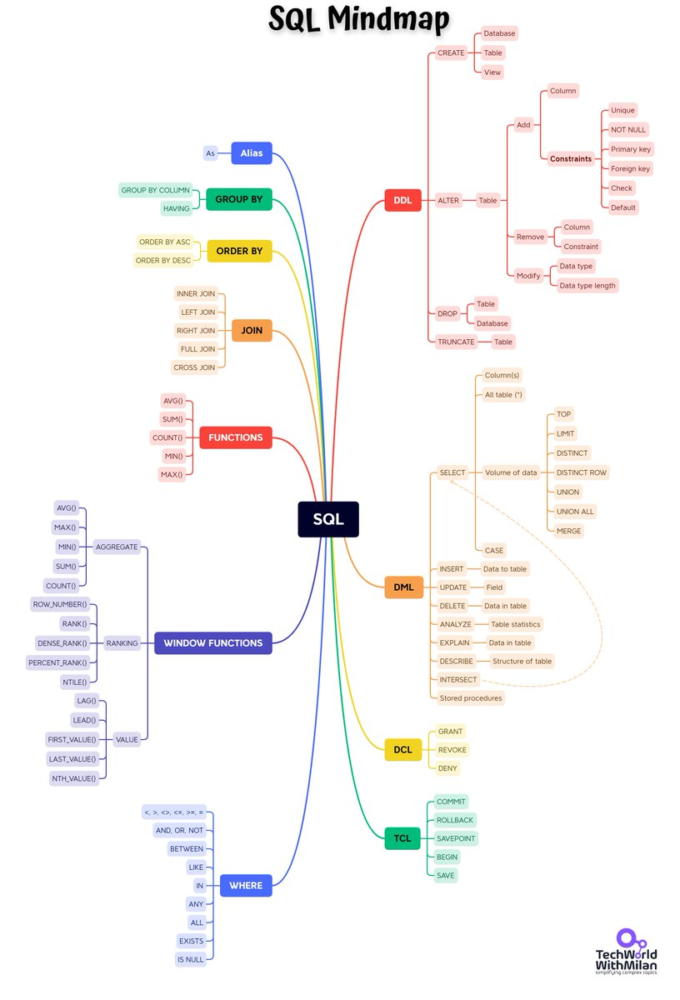
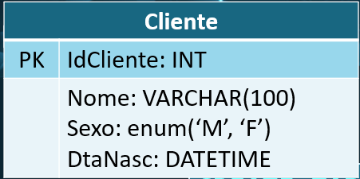
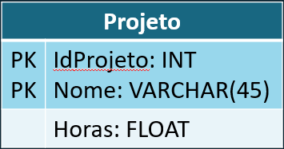
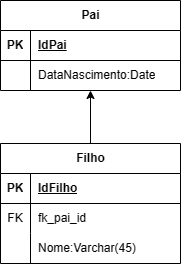

# **Banco de dados**
## Aula 07
### Linguagem DDL   
Felipe Marx Benghi
https://github.com/fbenghi/BancoDeDados2023-2


---

# Objetivos
- Introdução a linguagem SQL
- Cuidados com a sintaxe
- Linguagem DDL
    - Criar tabelas e esquemas
    - Excluir tabelas e esquemas
    - Editar tabelas
    - Chaves estrangeiras


---
# Linguagem SQL 

* Desenvolvida no início da década de 1970 pela IBM para programação e gerenciamento de base de dados relacionais
* O nome SQL hoje é expandido como Structured Query Language (Linguagem de Consulta Estruturada). Originalmente, SQL era chamada de SEQUEL (Structured English QUEry Language)
* A linguagem SQL pode ser considerada um dos principais motivos para o sucesso dos bancos de dados relacionais comerciais. 
* Um esforço conjunto entre o American National Standards Institute (ANSI) e a International Standards Organization (ISO) levou a uma versão-padrão da SQL (ANSI, 1986), chamada SQL-86. A versão mais recente é a ISO/IEC 9075:2016,

---
## Linguagem SQL 

* Data Definition Language (DDL): instruções que criam, alteram e deletam objetos da base de dados (não registros!!!). Estes objetos incluem tabelas, atributos, esquemas etc. 
* Data Manipulation Language (DML): instruções que manipulam e controlam os dados (registros). Como por exemplo, SELECT, INSERT, UPDATE.



---
## DDL (Data Definition Language)
* Na DDL, o resultado da compilação das definições é um conjunto de instruções para especificar os detalhes de implementação dos esquemas de banco de dados;
* A DDL possibilita a especificação de uma das relações (tabelas) ou de um conjunto de relações;
* Apesar da padronização ANSI/ISO/IEC, a sintaxe da SQL pode mudar um pouco de um SGBD para outro; a sintaxe utilizada neste material é válida para o SGBD MySQL.


---
### SQL - Cuidados gerais
* ; (Ponto e vírgula): maneira padrão de separar cada instrução SQL;
* \`texto\` (crase): devem ser usados para identificadores de tabelas e colunas, mas só são necessários quando o identificador é uma palavra-chave reservada ou quando o identificador contém caracteres de espaço em branco
```SQL
INSERT INTO `empresa`.`pai do filho` [...]
```

---
### SQL - Cuidados gerais
* '*texto*' (aspas simples): valores de string;

* "*texto*" (aspas duplas): valores de string, mas as aspas simples são mais amplamente aceitas por outros RDBMS

```SQL
INSERT INTO `empresa`.`projeto`
(`idProjeto`, `Nome`)
VALUES
(1,'Limpeza'),
(2,"Novo Produto");
```

---
### SQL - Cuidados gerais: Letras maiúsculas e minúsculas

* Palavras-chave SQL e nomes de funções: não diferencia-se maiúsculas de minúsculas.
```SQL
SELECT NOW();
select now();
sElEcT nOw();
```

* Nomes de bancos de dados e tabelas: depende do servidor. Em Windows não diferencia-se maiúsculas de minúsculas. UNIX *geralmente* são sensíveis a letras maiúsculas e minúsculas. Equivalente (no Windows):
```SQL
CREATE SCHEMA EMPRESA
CREATE SCHEMA empresa
```
---
### SQL - Cuidados gerais: Letras maiúsculas e minúsculas

* Nomes de colunas e índices: não diferencia-se maiúsculas de minúsculas
```SQL
CREATE TABLE IF NOT EXISTS Cliente (
  idCliente INT NOT NULL AUTO_INCREMENT);
```
```SQL
CREATE TABLE IF NOT EXISTS Cliente (
  IDCLIENTE int not null auto_increment);
```


---
# Esquema (Schema) / Base de Dados (database)

--- 
## Esquema (Schema) / Base de Dados (database)

* Agrupam tabelas e outras construções que pertencem à mesma aplicação de banco de dados. 
* schema = database (sinônimos)
* Você pode substituir `schema` e `database` nos comandos do MySQL

---
## Esquema (Schema) / Base de Dados (database)
https://dev.mysql.com/doc/refman/8.0/en/create-database.html
```SQL
CREATE {DATABASE | SCHEMA} [IF NOT EXISTS] db_name
    [create_option]
```
Exemplos:
* Criando ESQUEMA/BASE DE DADOS
```SQL
CREATE SCHEMA EMPRESA
CREATE DATABASE EMPRESA
```

* Criação somente se já não houver ESQUEMA/BASE DE DADOS com esse nome
```SQL
CREATE SCHEMA IF NOT EXISTS empresa;
CREATE DATABASE IF NOT EXISTS empresa;
```
---
## Uso de Esquema (Schema) / Base de Dados (database)
Para manipulação de dados em uma base de dados, é necessário informar qual base está em uso;
Para definir a base de dados em uso, utiliza-se o comando `USE`

* Comando
```SQL
use <nome da base de dados>
```
* Exemplo
```SQL
use universidade
```

---
# Exercício
Crie o esquema `Empresa` e defina-o para uso

---
# Criação de Tabela (Create Table)

Determina-se (nessa ordem)
1. Uma nova relação (tabela) com nome específico
1. Atributos (colunas)
1. Restrições


https://dev.mysql.com/doc/refman/8.0/en/create-table.html

```SQL
CREATE [TEMPORARY] TABLE [IF NOT EXISTS] tbl_name
    (create_definition,...)
```

---
## Comando: CREATE TABLE

Exemplos:
* Esquema (empresa) + Nome da Relação (Funcionario) 
```SQL
CREATE TABLE EMPRESA.FUNCIONARIO
```

* Sem esquema (esquema definido anteriormente)
```SQL
USE EMPRESA;
[...]
CREATE TABLE FUNCIONARIO
```

* Prevendo a possibilidade da tabela já existir
```SQL
CREATE TABLE IF NOT EXISTS FUNCIONARIO
```
---
## Especificando Colunas
```SQL
CREATE [TEMPORARY] TABLE [IF NOT EXISTS] tbl_name
    (create_definition,...)
```
Nome da coluna (col_name) + Definições da Coluna (column_definition)
```SQL
    create_definition: {
    col_name column_definition
    }
```

Definições da Coluna = Tipo do dado + (Restrições Constraints)
```SQL
    column_definition: {
    data_type [NOT NULL | NULL] [DEFAULT {literal | (expr)} ]
        [AUTO_INCREMENT] [UNIQUE [KEY]] [[PRIMARY] KEY]
        [COMMENT 'string']
        [check_constraint_definition]
    }
```

---
* Exemplo:
```SQL
CREATE TABLE IF NOT EXISTS empresa_completa.Projeto (
  idProjeto INT NOT NULL PRIMARY KEY)
```

---
# Exercício
Crie a seguinte tabela:



---
## MySQL Constraints (Restrições)
As restrições SQL são usadas para especificar regras para os dados em uma tabela, limitando o tipo de dados aceitos. 

Isso garante a precisão e confiabilidade dos dados da tabela. Se houver violação a uma restrição, a ação será abortada.

---
### Restrições - Colunas
**[NOT NULL | NULL]**: se o valor nulo (NULL) é ou não aceito para determinado atributo
> Dnumero INT NOT NULL,

**[UNIQUE [KEY]]**: especificado para atributos únicos
> Dnome VARCHAR(15) UNIQUE,


**[DEFAULT {literal | (expr)} ]**: valor padrão se um valor explícito não for definido
> idfuncionario INT NOT NULL DEFAULT 1,

---
### Restrições - Colunas
**[AUTO_INCREMENT]**: se não for definido um valor para o registro, ele será igual ao `(maior valor da coluna) + 1`
* Aplicável apenas a INTEIROS e FLOAT
* Só se pode criar uma coluna com AUTO_INCREMENT por tabela 
* Colunas com AUTO_INCREMENT não podem ter valor DEFAULT
<br>

**[COMMENT 'string']**: comentário para esclarecer o propósito da coluna

---
### Restrições - Colunas
**[[PRIMARY] KEY]**: identifica unicamente cada linha/registro
* Deve ser definida como `NOT NULL`, se não for explicitamente declarada como NOT NULL, o MySQL declara o atributo como tal (silenciosamente/sem aviso).

> idProjeto INT NOT NULL PRIMARY KEY

* Não se pode criar uma tabela como múltiplas chaves primárias, mas uma chave primária pode ter múltiplas colunas. Neste caso, deve-se usar a notação `PRIMARY KEY(idProjeto,Nome)`.

```SQL
CREATE TABLE IF NOT EXISTS Projeto (
  idProjeto INT NOT NULL,
  Nome VARCHAR(45) NOT NULL,
  PRIMARY KEY(idProjeto,Nome)
);
```

---

**[CHECK]**: limita os valores de atributo através de uma verificação
> Dnumero INT NOT NULL CHECK (Dnumero > 0 AND Dnumero < 21)

---
## Exemplo de comando CREATE TABLE

```SQL
CREATE TABLE IF NOT EXISTS Cliente (
  idCliente INT NOT NULL AUTO_INCREMENT,
  cpf CHAR(11) NOT NULL UNIQUE,
  Nome VARCHAR(45) NULL COMMENT 'Nome do cliente',
  status ENUM('ativo','inativo') DEFAULT ('inativo'),
  Departamento_idDepartamento INT UNSIGNED NULL,
  PRIMARY KEY (idCliente));
```
---
# Exercício
Crie a seguinte tabela:
* IdProject deve ser incrementado automaticamente a cada projeto
* Horas não pode ser negativa


---
## Deletando Esquema
```SQL
DROP {DATABASE | SCHEMA} [IF EXISTS] db_name
```
* Exemplo: deletando esquema `empresa`
```SQL
DROP SCHEMA IF EXISTS empresa
```


---
## Deletando Tabela
```SQL
DROP [TEMPORARY] TABLE [IF EXISTS]
    tbl_name [, tbl_name] ...
```
* Exemplo: deletando tabelas `funcionario` e `departamento`
```SQL
DROP TABLE IF EXISTS funcionario, departamento;
```

---
# Exercício
Apague:
1. As tabelas criadas
1. O esquema criado

---
## ALTER TABLE
https://dev.mysql.com/doc/refman/8.0/en/alter-table.html

```SQL
ALTER TABLE tbl_name
    [alter_option [, alter_option] ...]
```
A instrução ALTER TABLE é usada para:
* Adicionar, excluir ou modificar colunas em uma tabela existente
* Adicionar e eliminar restrições em uma tabela existente.

--- 
## ALTER TABLE - Adicionar colunas

```SQL
ALTER TABLE table_name
ADD [COLUMN] column_name datatype;
```

Exemplo:
* Adicionar a coluna `email` a tabela `cliente`
```SQL
ALTER TABLE cliente
ADD email varchar(255);
```
---
# Exercício
1. Recrie a tabela Cliente. 
1. Adicione uma coluna para o CPF:DEC(11), que deve ser única


---
## ALTER TABLE - Remover colunas
```SQL
ALTER TABLE table_name
DROP [COLUMN] column_name;
```
Exemplo:
* Remover a coluna `email` da tabela `cliente`:
```SQL
ALTER TABLE Customers
DROP COLUMN Email;
```
---
## ALTER TABLE - Modificar o tipo da coluna

```SQL
ALTER TABLE table_name
MODIFY COLUMN column_name column_type;
```
Exemplo: aumentar o número máximo de letras  permitido para a coluna `nome`
```SQL
ALTER TABLE pessoa
MODIFY COLUMN nome VARCHAR(200);
```
---
## ALTER TABLE - Modificar restrições e mais
```SQL
ALTER TABLE tbl_name
    [alter_option [, alter_option] ...]
```

```SQL
alter_option: {
    CHANGE [COLUMN] old_col_name new_col_name column_definition
}
```
```SQL
column_definition: {
    data_type [NOT NULL | NULL] [DEFAULT {literal | (expr)} ]
        [AUTO_INCREMENT] [UNIQUE [KEY]] [[PRIMARY] KEY]
        [COMMENT 'string']
        [check_constraint_definition]
    }
```
---
## ALTER TABLE - Modificar restrições e mais
* Exemplo: alterar o nome da coluna de nome para pnome, com as restrições (NOT NULL;UNIQUE)

```SQL
ALTER TABLE cliente
CHANGE COLUMN nome pnome VARCHAR(200) NOT NULL UNIQUE;
```


---
# Exemplo

1. Altere o nome da coluna `nome` para `sobrenome`
1. Crie uma coluna primeiro_nome
1. Descarte a coluna CPF
1. Altere o nome da coluna `Sexo` para `Genero` e permita as seguintes opções ('Masculino','Feminino', 'Outro')


---
## Chave estrangeira (foreign key)
* Usadas para criar referências cruzadas entre tabelas.
* Pode ser usado em comandos `CREATE TABLE` ou `ALTER TABLE`



---
## Chave estrangeira (foreign key)

```SQL
CREATE TABLE IF NOT EXISTS pai (
    pai_id INT NOT NULL AUTO_INCREMENT,
    PRIMARY KEY (pai_id)
);

CREATE TABLE IF NOT EXISTS filho (
    id INT PRIMARY KEY AUTO_INCREMENT,
    fk_pai_id INT,
    CONSTRAINT fk_pai_id_filho_id FOREIGN KEY (fk_pai_id)
        REFERENCES pai(pai_id)
);
```

CONSTRAINT func_dept

---
# Exercício
1. Crie as tabelas `pai` e `filho`
1. Tente adicionar um registro a tabela `filho`
1. Tente adicionar um registro a tabela `pai`
1. Tente adicionar um registro a tabela `filho`
1. Tente deletar um registro a tabela `pai`, que seja referenciado na tabela `filho`
```SQL
DELETE FROM pai WHERE pai_id = 1;
```

---
## Chave estrangeira (foreign key)
https://dev.mysql.com/doc/refman/5.7/en/create-table-foreign-keys.html
```SQL
[CONSTRAINT [symbol]] FOREIGN KEY
    [index_name] (col_name, ...)
    REFERENCES tbl_name (col_name,...)
    [ON DELETE reference_option]
    [ON UPDATE reference_option]

reference_option:
    RESTRICT | CASCADE | SET NULL | NO ACTION | SET DEFAULT
```


---
## reference_option

Quando uma operação UPDATE ou DELETE afeta uma CHAVE na tabela pai que é usada na tabela filha, algumas ações podem ser tomadas para garantir a integralidade do Banco de Dados. Elas se aplicam:
* Ao atualizar-se o registro (ON UPDATE)
* Ao apagar-se o registro (ON DELETE) 

---
## reference_option

Opções:
* CASCADE: atualiza/deleta automaticamente as linhas correspondentes na tabela filho.
* SET NULL: define a coluna ou colunas de chave estrangeira na tabela filho como NULL.
* RESTRICT: rejeita a operação de exclusão ou atualização da tabela pai. Especificar RESTRICT (ou NO ACTION) é o mesmo que omitir a cláusula ON DELETE ou ON UPDATE.
* NO ACTION: Uma palavra-chave do SQL padrão. Equivalente a RESTRICT;

---
## reference_option
Exemplo 1: Relaciona a tabela `pai` com a tabela `filho` através do atributo `id` da tabela `pai`. Se o `id` da tabela `pai` for deletado, o mesmo é feito 

```SQL
CREATE TABLE pai (
    id INT NOT NULL,
    PRIMARY KEY (id)
)

CREATE TABLE filho (
    id INT,
    pai_id INT,
    FOREIGN KEY (pai_id)
        REFERENCES pai(id)
        ON DELETE CASCADE
)
```

---
# ALTER TABLE - foreign key
* Adicão de foreign key:

```SQL
ALTER TABLE Orders
ADD CONSTRAINT FK_PersonOrder
FOREIGN KEY (PersonID) REFERENCES Persons(PersonID);
```

* Remoção de foreign key:
```SQL
ALTER TABLE Orders
DROP CONSTRAINT FK_PersonOrder;
```
---
## Nota: foreign key sem nome (sem [CONSTRAINT [symbol]])

A chave é nomeada automaticamente. Para descobrir o nome, pode-se usar o seguinte comando.

```SQL
select CONSTRAINT_NAME
from INFORMATION_SCHEMA.TABLE_CONSTRAINTS
where TABLE_NAME = 'table name'

```

---
# Exercício
1. Delete a tabela filho
1. Recrie a mesma tabela, mas dessa vez
    * Adicione um nome para a chave estrangeira
    * Adicione uma opção de referencia, em que se o registro for apagado na tabela pai, ele é apagado na tabela filho.

---
# FIM


