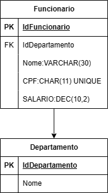
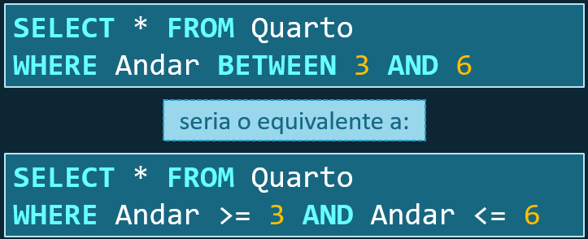
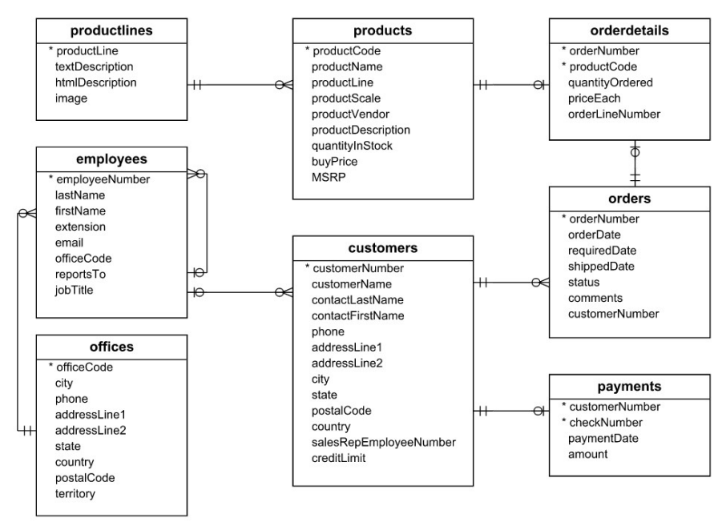

# **Banco de dados**
## Aula 08
### Linguagem DML   
Felipe Marx Benghi
https://github.com/fbenghi/BancoDeDados2023-2


---

# Objetivos
- [x] DML
- [x] Inserção
- [x] Seleção
- [x] Edição de registros

---
# Exercício 1:
* Crie as seguintes tabelas:
Notas: 
1. chaves primárias devem ser autoincrementáveis





---
## Data Manipulation Language (DML) - Linguagem de Manipulação de dados

Instruções para adicionar (inserir), excluir e modificar (atualizar) dados em um banco de dados.

Lista de comandos DML:

* INSERT: inserir dados em uma tabela.
* UPDATE: atualizar dados existentes em uma tabela.
* DELETE: excluir registros de uma tabela de banco de dados.

---
## INSERT - Opção 1
Os valores devem ser listados na mesma ordem em que os atributos correspondentes foram especificados no comando CREATE TABLE.

```SQL
INSERT INTO table_name
VALUES (value1, value2,...)
```
Exemplo:
```SQL
INSERT INTO FUNCIONARIO
VALUES ('Ricardo', 'Marini', '65329865388', '30-12-1962');
```

---
# Exercício 2:
1. Crie os departamentos: RH, TI, Engenharia
* RH;
* FINANÇAS;
* TI;
* P&D;


---
## INSERT - Opção 2
A instrução INSERT permite que o usuário explicite os nomes dos atributo que correspondem aos valores fornecidos. 
```SQL
INSERT INTO table_name(column_name2,column_name3,...)
VALUES (value2, value3,...)
```
Exemplo:
```SQL
CREATE TABLE IF NOT EXISTS cliente (
    IdCliente INT PRIMARY KEY AUTO_INCREMENT,
    NOME VARCHAR(100),
);

INSERT INTO cliente (NOME)
VALUES ('Ricardo');
```

Útil quando a tabela tiver atributos: NULL, DEFAULT e AUTO_INCREMENT.

---
## INSERT - Opção 3
A instrução INSERT permite que sejam incluídos vários registros simultaneamente em uma relação.

```SQL
INSERT INTO table_name(column_name2,column_name3,...)
VALUES (value2, value3,...)
```
Exemplo:
```SQL
INSERT INTO FUNCIONARIO (Pnome, Unome, Cpf)
VALUES 
('Ricardo', 'Marini',   4, '78956210121'),
('Felipe',  'Siqueira', 4, '65329865388'),
('Luisa',   'Pinio',    4, '43245467689'),
('Ana',     'Da Silva', 4, '56523245653');
```

---
# Exercício 3:
1. Cadastre 3 funcionários que trabalhem para cada departamento


---
## SELECT
* As consultas em SQL podem ser muito complexas
* A forma básica do comando SELECT, às vezes chamada de mapeamento ou 
bloco select-from-where, é composta pelas três cláusulas SELECT, FROM e WHERE:

```SQL
SELECT <lista de atributos>          /* selecione os atributos */
FROM   <lista de tabelas>            /* a partir de */
WHERE  <condicao>;                   /* onde */
```

\<lista atributos\>: nomes dos atributos cujos valores devem ser recuperados 
\<lista tabelas\>: nomes de tabelas exigidos para processar a consulta.
\<condição\>: expressão condicional (booleana) que identifica as tuplas a serem 
recuperadas pela consulta.

---
## SELECT
A clausula WHERE não é obrigatória. A sua ausência indica que não há condição sobre a seleção. 

```SQL
SELECT <lista de atributos>          /* selecione os atributos */
FROM   <lista de tabelas>            /* a partir de */
```

**Todos os registros da relação especificada na cláusula FROM são selecionados como resultado da consulta.**

---
Exemplos:
```SQL
SELECT nome FROM EMPRESA.FUNCIONARIO;
SELECT nome FROM FUNCIONARIO;
SELECT nome, salario FROM FUNCIONARIO;
SELECT * FROM FUNCIONARIO;
```

Para recuperar todos os valores de atributo das tuplas selecionadas, não precisamos listar os nomes de atributo explicitamente em SQL; basta especificar um asterisco (*).

---

# Exercício 4:
1. Liste todos os departamentos
1. Liste o nome de todos os funcionários
1. Liste o salário e o CPF de todos os funcionários


---

## SELECT com condições
A cláusula WHERE é utilizada para filtrar registros específicos que atendam a uma determinada condição;

O filtro pode ser aplicado através de operadores algébricos, relacionais e lógicos:

* Algébricos:  *  /  +  -
* Relacionais:  =  <>  >  <  >=  <=  BETWEEN  LIKE
* Lógicos:  AND  OR  NOT

---

## SELECT com condições
Operadores lógicos básicos de comparação são =, <, <=, >, >= e <> (diferente)

Exemplo: Recuperar a data de nascimento e o endereço do(s) funcionário(s) cujo CPF seja '11122233344'

```SQL
SELECT Datanasc, Endereco
FROM FUNCIONARIO
WHERE cpf='11122233344';
```

Exemplo: Listar todos os atributos dos funcionários cujo atributo `cargo` seja diferente de gerente.

```SQL
SELECT *
FROM FUNCIONARIO
WHERE cargo<>'Gerente';
```

---
## SELECT com múltiplas condições
É possível usar as palavras chaves AND (e) and OR (ou) para adicionar mais condições a busca

Exemplo: liste o `nome` de todos os funcionários que tenham salário entre 5.000 e 10.000
```SQL
SELECT nome
FROM FUNCIONARIO
WHERE salario > 5000 AND salario < 10000;
```
Exemplo: liste o `nome` de todos os funcionários que morem em Curitiba ou São Paulo
```SQL
SELECT nome
FROM FUNCIONARIO
WHERE cidade = 'Curitiba' OR  cidade = 'São Paulo';
```

---
## Cláusula BETWEEN
* Usada para filtrar por faixas de valores: valor que seja maior ou igual a um valor e menor ou igual a outro valor;
Exemplo: “Listar todos os quartos entre o 3º e 6º andares.”


---
## Cláusula LIKE

Possibilita a verificação de ocorrência de caractere(s) dentro de strings:
Exemplo - Filtrar registros que:
* iniciem com uma sequência;
* terminem com uma sequência; 
* contenham determinada sequência no meio do campo.

Exemplo: “Listar os clientes cujo nome inicie com ‘A’.”:

```SQL
SELECT * FROM Cliente
WHERE Nome LIKE 'A%'
```
---
## Cláusula LIKE

O caractere % (percentual) é coringa para substring;
O caractere _ (sublinado) é coringa para caractere.
Exemplos:
* `Ba%` – qualquer string que comece com “Ba”
* `%ba` – qualquer string que termine com “ba”
* `%iba%` – qualquer string que possua uma substring “iba”
* `___` – qualquer string com 3 caracteres
* `___%` – qualquer string com pelo menos 3 caracteres.

---

# Exercício 5:
1. Liste o nome dos funcionários que trabalham para o RH
1. Liste o nome dos funcionários que trabalham para o RH e ganham mais do que R$10.000
1. Liste o nome dos funcionários que trabalham para o RH ou TI e que ganhem mais do que R$10.000


---


---
## SELECT com valores distintos

Se quisermos eliminar registros duplicados do resultado, usamos a palavra-chave DISTINCT na cláusula SELECT.

Exemplo: liste os nomes dos funcionários sem repetição

```SQL
SELECT DISTINCT pnome
FROM FUNCIONARIO;
```

---
# Exercício 6:
1. Liste os salários pagos pela empresa sem repetição


---
## SELECT com ordenação
A SQL permite que o usuário ordene as tuplas no resultado de uma consulta pelos valores de um ou mais dos atributos que aparecem, usando a cláusula ORDER BY.
* DESC: resultado em uma ordem decrescente de valores
* ASC: ordem crescente (valor padrão - pode ser omitido)

Exemplo: Ordene os salários de uma empresa em ordem decrescente
```SQL
SELECT Salario
FROM FUNCIONARIO;
ORDER BY Salario DESC
```

Exemplo: Indique os nomes dos funcionários de uma empresa do mais novo para o mais velho
```SQL
SELECT nome
FROM FUNCIONARIO;
ORDER BY Datanasc ASC
```

---
# Exercício 7:
1. Apresente os salários pagos pela empresa em ordem crescente e sem repetição
1. Apresente os salários maiores do que 5.000 pagos pela empresa em ordem crescente e sem repetição
1. Apresente o nome dos funcionários em ordem alfabética
1. Apresente o nome dos funcionários que terminem com a letra `a`
1. Apresente o nome dos funcionários que possuam a letra `a`


---
# Exercício 7:
1. Liste o nome do funcionário e o nome do departamento para o qual ele trabalha. 


---
## Modificar registros - Update
```
UPDATE nome_tabela
SET coluna1 = value1, coluna2 = coluna2, ...
WHERE condição;
```

Exemplo:
```SQL 
UPDATE Cliente
SET NomeCliente = 'Alfred Schmidt', Cidade = 'Frankfurt'
WHERE ClienteId = 1;
```

---
## Modificar registros - Update

IMPORTANTE: o WHERE determina quantos registros serão atualizados (podem ser muitos)

Exemplo: Atualiza TODOS os registros
```SQL 
UPDATE Customers
SET StatusCadastro = 'Inválido'
```


Exemplo: somente o registro com o Id indicado
```SQL 
UPDATE Cliente
SET StatusCadastro = 'Inválido'
WHERE ClienteId = 1;
```

--- 
## Apagar registros - Delete

```SQL
DELETE FROM 
    nome_tabela 
WHERE 
    condição;
```
Exemplo:
```SQL 
DELETE FROM cliente 
WHERE NomeCliente ='Alfreds Futterkiste';
```

---
## Apagar registros - Delete

IMPORTANTE: o WHERE determina quantos registros serão apagados (podem ser muitos)
Exemplo: Apaga a tabela inteira
```SQL
DELETE FROM table_name;
DELETE FROM cliente;
```

Apaga somente a linha com o registro indicado
```SQL
DELETE FROM cliente
WHERE clienteId = 1;
```

---
## Exercício
1. Atualize o CPF do Antônio
1. Corrija o Salário da Aline
1. Apague a departamento P&D

---

# Exercício
Baixe o banco de dados
https://www.mysqltutorial.org/wp-content/uploads/2018/03/mysqlsampledatabase.zip

---


---
## Para a tabela `employees`
1. Liste todos os cargos (`jobTitle`) da empresa sem repetição
1. Liste os primeiro nomes (`firstName`) da tabela empregados (`employees`) em ordem alfabética
1. Qual o nome do Presidente (`jobTitle` = `president`) da empresa? 
1. Liste o email de todos os representantes de venda (`jobTitle` = `Sales Rep`)
1. Liste todos os funcionários que reportam (`reportsTo`) para o funcionário com email `wpatterson@classicmodelcars.com`
1. Cadastre três novos funcionários na tabela 

---

---


---

# FIM


