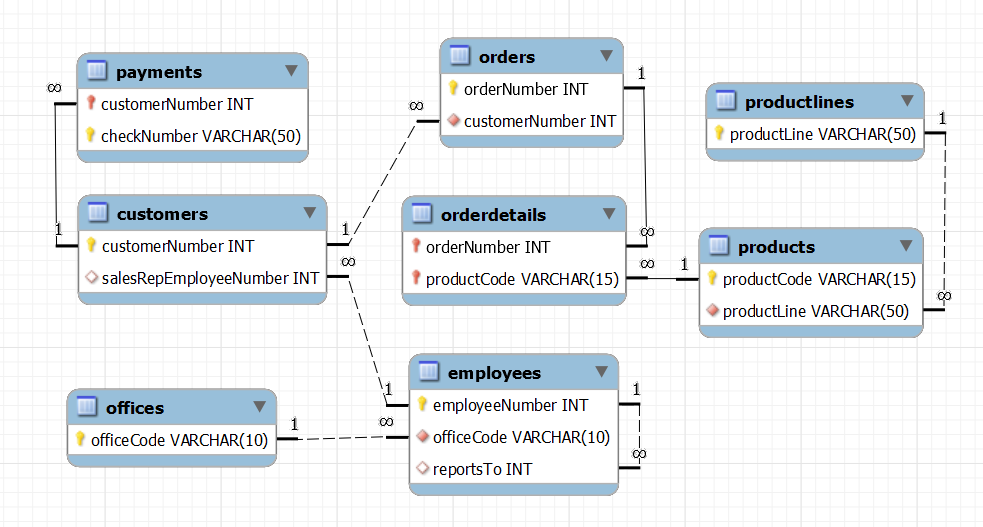

# **Banco de dados**
## Aula 09 - Projeto Físico
Prof. Felipe Marx Benghi 

# Exercício
Baixe a base de dados de:
https://www.mysqltutorial.org/wp-content/uploads/2018/03/mysqlsampledatabase.zip

O diagrama que representa esse diagrama é:

1. Qual o valor total da ordem de compra 10100 (tabela `orderdetails`, coluna `orderNumber` = 10100)? Quantos produtos foram comprados?

1. Liste o nome dos produtos que fazem parte da ordem de compra 10100?

1. Qual linha dos produtos (tabela `productlines`) que fazem parte da ordem de compra 10100

1. Liste o nome dos produtos que fazem parte da ordem de compra 10100, o preço gasto por produto e a linha do produto.