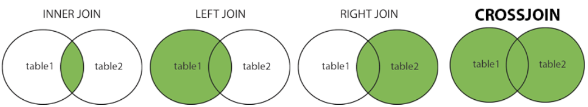
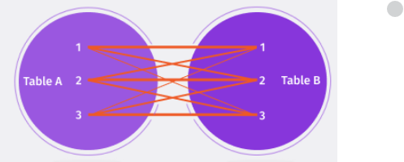

# **Banco de dados**
## Aula 09
### Joins e Agregação
Felipe Marx Benghi
https://github.com/fbenghi/BancoDeDados2023-2


---

# Objetivos
- [x] JOINS INNER | OUTER | LEFT | Join | Cross
- [x] Agregadores: COUNT, SUM, AVG, MAX e MIN

---
# JOINS

A cláusula JOIN no SQL é uma forma de relacionar duas tabelas e gerar uma tabela resultante com as relações explícitas entre elas


---
## JOINS

* INNER JOIN: Retorna registros que têm valores correspondentes em ambas as tabelas.
* LEFT JOIN: Retorna todos os registros da tabela da esquerda e os registros correspondentes da tabela da direita.
* RIGHT JOIN: Retorna todos os registros da tabela da direita e os registros correspondentes da tabela da esquerda.
* CROSS JOIN: Retorna todos os registros de ambas as tabelas



---
### Cross Join
Os CROSS são usados para combinar cada linha de uma tabela com cada linha de outra tabela, e retornar o produto cartesiano dos conjuntos de linhas das tabelas que são unidas.



---
## JOINS
```SQL
SELECT column_name(s)
FROM table1 [INNER | LEFT | RIGHT ] JOIN table2
ON table1.column_name = table2.column_name;
```
Exemplo:
```SQL
SELECT Orders.OrderID, Customers.CustomerName
FROM Orders
INNER JOIN Customers ON Orders.CustomerID = Customers.CustomerID;
```
---
### JOINs + WHERE

```SQL
SELECT Orders.OrderID, Customers.CustomerName
FROM Orders INNER JOIN Customers 
ON Orders.CustomerID = Customers.CustomerID
WHERE Customers.CustomerName = 'Empresa X';
```

A tabela Orders e Customers são combinadas com base na condição Orders.CustomerID = Customers.CustomerID. 

A cláusula WHERE é usada para filtrar os resultados para incluir apenas aqueles onde o CustomerName é ‘Empresa X’. 

---
## Exercícios
1. Liste o nome de todos os funcionários e todas seus respectivos departamentos
1. Liste os Funcionários que trabalhem para o RH
1. Liste os Funcionários que trabalhem para o RH e Finanças

---
# Agregadores

---
## Agregadores


COUNT(): número de linhas que correspondem a um critério especificado.

```SQL
SELECT COUNT(column_name)
FROM table_name
WHERE condition;
```

AVG(): valor médio de uma coluna numérica 

```SQL
SELECT AVG(column_name)
FROM table_name
WHERE condition;
```

SUM(): soma total de uma coluna numérica

```SQL
SELECT SUM(column_name)
FROM table_name
WHERE condition;
```

---
## Agregadores
MIN(): retorna o menor valor da coluna selecionada

```SQL
SELECT MIN(column_name)
FROM table_name
WHERE condition;
```

MAX(): retorna o maior valor da coluna selecionada.

```SQL
SELECT MAX(column_name)
FROM table_name
WHERE condition;
```

---
## Exercícios
1. Qual o valor da folha salarial da empresa?
1. Qual a média de salários da empresa?
1. Qual o maior e menor salário da empresa?
1. Qual a média do salário dos funcionários que trabalham para o RH?
1. Quantos funcionários trabalham para o Financeiro? Qual a media salarial desse departamento? Qual o valor máximo e mínimo?

DESAFIO: 
> Qual o nome do funcionário com o menor salário da empresa?


---
# ALIASES 
“apelido” ou “nome alternativo”

---
## ALIASES

Os aliases são usados para dar a uma tabela, ou a uma coluna em uma tabela, um nome temporário.

Os aliases são frequentemente usados para tornar os nomes das colunas mais legíveis.

Um alias só existe durante a duração daquela consulta.

Um alias é criado com a palavra-chave AS.

---
## ALIASES
```SQL
SELECT column_name AS alias_name
FROM table_name;
```

```SQL
SELECT min(salario) as MIN_SALARIO
FROM FUNCIONARIO
INNER JOIN DEPARTAMENTO ON DEPARTAMENTO.iddepartamento = FUNCIONARIO.iddept;
```

---

# FIM


