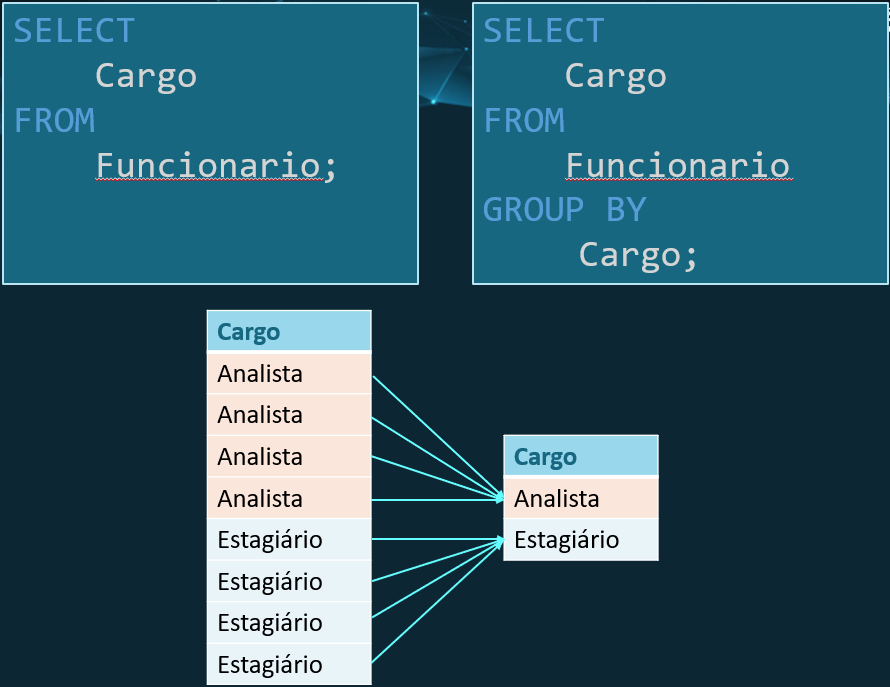
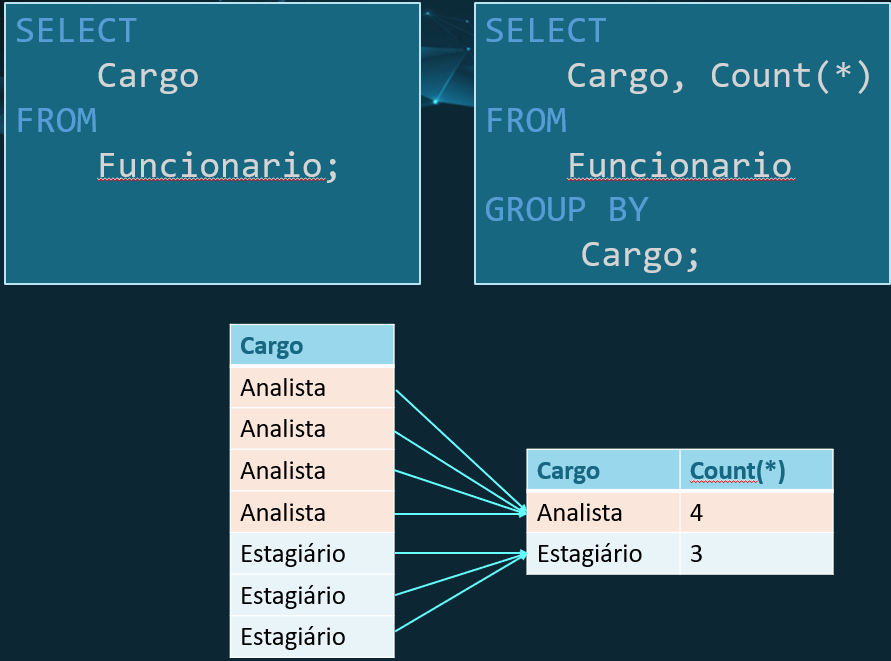
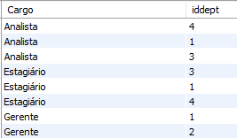

# **Banco de dados**
## Aula 10
### Agrupamento
Felipe Marx Benghi
https://github.com/fbenghi/BancoDeDados2023-2


---

# Objetivos
- [x] Group by (agrupamento)
- [x] Having (filtragem)

---
# Group by
- O agrupamento permite que sejam obtidas informações sobre sub-grupos das tabelas. Por exemplo:
    - Quantos funcionários trabalham para CADA departamento? => Dados agrupados por DEPARTAMENTO
    - Qual a média dos salários dos funcionários para CADA cargo => Dados agrupados por CARGO

- Isso é útil principalmente quando precisamos contar, somar, tirar média etc. de um subconjunto de registros agrupados;

---
## Pode parecer com um SELECT DISTINCT...



---
## Mas podemos acrescentar dados agregadores (MAX, MIN, AVG, COUNT, SUM)


---
# Exercícios:
1. Qual o salário médio por cargo?
1. Qual o salário médio, min e máximo por cargo?
1. Quantos funcionários trabalham por departamento? 
1. Qual a média dos salários que trabalham para o RH?
1. Qual a média dos salários dos cargos por departamento?
1. O que acontece se tentarmos agregar os dados por CPF?

---
## Importante 1:
Só faz sentido aplicar ``group by`` quando existirem subgrupos.

Exemplo: Em uma tabela sobre pessoas, não faz sentido aplicar o agrupamento para CPFs, pois pessoa terá um CPF próprio e não será possível formar grupos.

---
## Importante 2:

* Podemos ter mais de uma condição de agrupamento

* Todos os campos usados no SELECT, que não são função de agregação, devem ser mencionados no GROUP BY

```SQL
SELECT 
    Cargo, iddept
FROM
    Funcionario
GROUP BY Cargo , iddept;
```



---
## Having
* Podemos especificar condição de filtro para GRUPOS usando a cláusula MySQL HAVING junto com GROUP BY.

Exemplos:
1. Liste somente os departamentos que tem mais do que 5 funcionários
1. Liste os cargos que tem média salarial maior do que 5000
1. Qual o departamento que tem o maior salário?

---


# FIM


