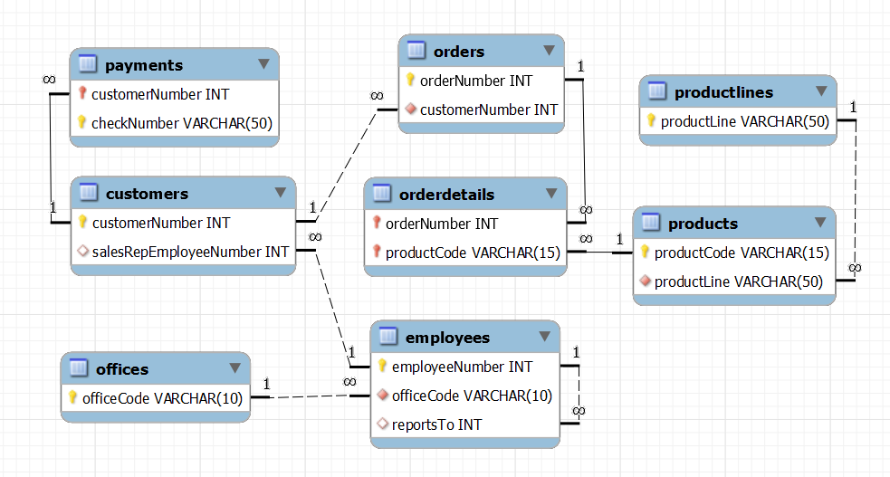

# **Banco de dados**
## Aula 10 - Agrupamento
Prof. Felipe Marx Benghi 

# Exercício
Baixe a base de dados de:
https://www.mysqltutorial.org/wp-content/uploads/2018/03/mysqlsampledatabase.zip

O diagrama que representa esse diagrama é:

1. Quantas ordens de compra cada cliente já pediu?

    Tabela: `Orders` - Ordens de Compra
        Colunas de interesse: `CustomerNumber` Número do cliente

1. Quais clientes tem mais de 10 ordens de compra?
    Tabela: `Orders` - Ordens de Compra
        Colunas de interesse: `CustomerNumber` Número do cliente

1. Qual o valor total de cada ordem de compra?
    Tabela: `orderdetails` - Detalhes da Ordem
        Colunas de interesse:
            `orderNumber` - Número da Ordem 
            `priceEach` - Preço de cada produto 
            `quantityOrdered` - quantidade de produtos ordenados

1. Qual o nome dos clientes responsáveis pelas 5 maiores ordem de compra?
    Tabela: `orderdetails` - Detalhes da Ordem
        Colunas de interesse: 
            `orderNumber` - Número da Ordem 
            `priceEach` - Preço de cada produto 
            `quantityOrdered` - quantidade de produtos ordenados
    
    Tabela: `Orders` - Ordens de Compra
        Colunas de interesse: 
            `orderNumber` - Número da Ordem 
            `CustomerNumber` - Número do cliente
    
    Tabela: `Customers` - Consumidores
        Colunas de interesse: 
            `CustomerName` - Número da Cliente 
            `CustomerNumber` - Número do cliente
