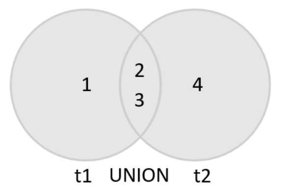
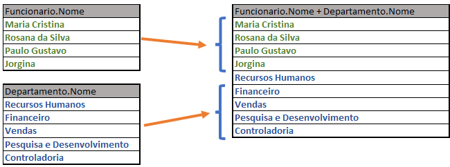
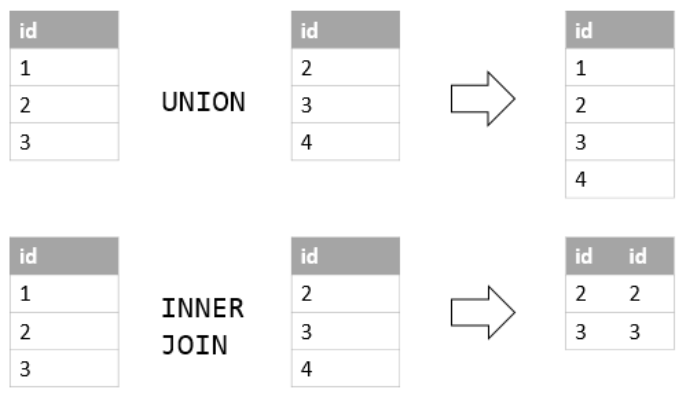

# **Banco de dados**
## Aula 11
### Views e Unions
Felipe Marx Benghi
https://github.com/fbenghi/BancoDeDados2023-2


---

# Objetivos
- [x] Union
- [x] View

---
## Union
* O operador UNION é usado para combinar dois ou mais conjuntos de resultados de várias instruções SELECT em um único conjunto de resultados.




---
## Exemplo de UNION:
Liste o nome dos departamentos e o nome dos funcionários.
```SQL
SELECT
	nome
FROM 
	funcionario
UNION 
select
	NOME
FROM
	departamento;

```



---
## Diferença para do UNION para um JOIN




---
## Condições para que o UNION funcione:

* o número e a ordem das colunas que aparecem em todas as instruções SELECT devem ser os mesmos. 
* os tipos de dados das colunas devem ser iguais ou compatíveis.

---
# Exercícios de UNION

---

## View ou tabelas virtuais

* Uma view é conjunto de SELECTs cadastrados, que retornam uma visualização de dados específica de uma ou mais tabelas de um banco de dados. 
* Quando você emite a instrução SELECT contra a view, o MySQL executa a consulta subjacente especificada na definição da view e retorna o conjunto de resultados.
* VIEWS não fazem parte do esquema físico da base de dados. 

---
## Exemplo de views
* Criando VIEW
```SQL
CREATE VIEW funcionario_cargo as
SELECT 
    cpf,
    cargo, 
    salario
FROM
	funcionario;
``` 

* Deletando VIEW
```SQL
DROP VIEW [IF EXISTS] nome_view;
```
---
## Motivos para usar Views

1. Simplificar consulta complexa 
1. Tornar a lógica de negócios consistente
1. Adicionar camadas extras de segurança
1. Habilitar compatibilidade retroativa

---
### Views Atualizáveis (UPDATE/INSERT diretamente na view)

Para uma visão ser atualizável, deve haver uma relação um-para-um entre as linhas da view e as tabela originais. 
Existem também certas outras construções que tornam uma visão não atualizável:

* Funções de agregação: (SUM(), MIN(), MAX(), COUNT(), ...)
* DISTINCT
* GROUP BY
* HAVING
* UNION ou UNION ALL
* Subconsulta na lista de seleção

---
# Exercícios de VIEW

---

# FIM